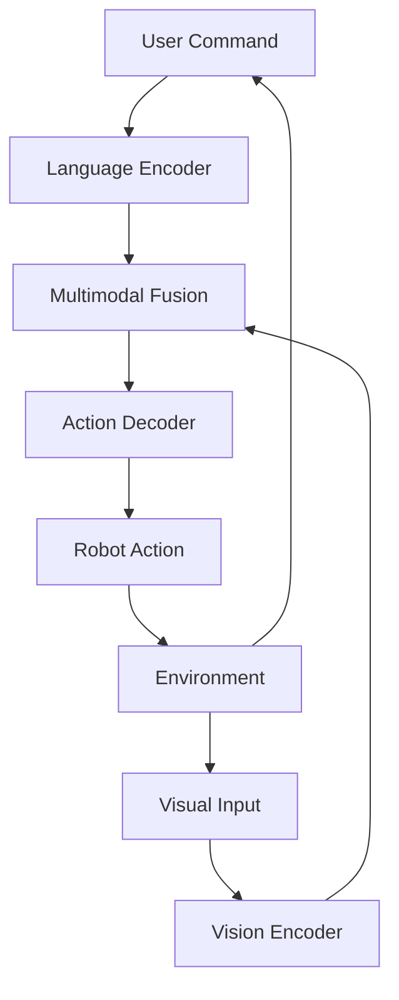

# Appendix D: Vision-Language-Action (VLA) Implementation

## Introduction to VLA Systems

Vision-Language-Action (VLA) systems integrate visual perception, natural language understanding, and physical action execution to enable robots to respond to natural language commands while perceiving and acting in the physical world. This integration represents a significant advancement in embodied AI and robotics.

## Architecture Overview

### Core Components
A typical VLA system consists of three main components that work together:

1. **Vision System**: Processes visual input to understand the environment
2. **Language System**: Interprets natural language commands and queries
3. **Action System**: Executes physical actions based on the interpreted command and visual context

### System Diagram


## Implementation Pattern

### Basic VLA Architecture
```python
import torch
import torch.nn as nn
import numpy as np
from transformers import CLIPProcessor, CLIPModel
import openai  # For language processing

class VisionEncoder(nn.Module):
    def __init__(self, pretrained_model_name='openai/clip-vit-base-patch32'):
        super().__init__()
        self.clip_model = CLIPModel.from_pretrained(pretrained_model_name)
        self.processor = CLIPProcessor.from_pretrained(pretrained_model_name)
        
        # Additional layers for robotics-specific features
        self.feature_projection = nn.Linear(512, 768)  # Adjust based on clip model output
        
    def forward(self, pixel_values):
        # Extract visual features using CLIP
        visual_features = self.clip_model.get_image_features(pixel_values)
        projected_features = self.feature_projection(visual_features)
        return projected_features

class LanguageEncoder(nn.Module):
    def __init__(self, pretrained_model_name='bert-base-uncased'):
        super().__init__()
        from transformers import AutoTokenizer, AutoModel
        self.tokenizer = AutoTokenizer.from_pretrained(pretrained_model_name)
        self.model = AutoModel.from_pretrained(pretrained_model_name)
        
    def forward(self, input_ids, attention_mask):
        outputs = self.model(input_ids=input_ids, attention_mask=attention_mask)
        # Use CLS token representation
        return outputs.last_hidden_state[:, 0, :]

class MultimodalFusion(nn.Module):
    def __init__(self, feature_dim=768):
        super().__init__()
        self.feature_dim = feature_dim
        
        # Cross-modal attention mechanism
        self.vision_to_language = nn.MultiheadAttention(
            embed_dim=feature_dim,
            num_heads=8,
            batch_first=True
        )
        
        self.language_to_vision = nn.MultiheadAttention(
            embed_dim=feature_dim,
            num_heads=8,
            batch_first=True
        )
        
        # Fusion projection
        self.fusion_proj = nn.Sequential(
            nn.Linear(feature_dim * 2, feature_dim),
            nn.ReLU(),
            nn.Linear(feature_dim, feature_dim)
        )
    
    def forward(self, vision_features, language_features):
        # Reshape features for attention (add sequence dimension)
        vision_reshaped = vision_features.unsqueeze(1)  # [B, 1, D]
        language_reshaped = language_features.unsqueeze(1)  # [B, 1, D]
        
        # Cross attention: language guides vision
        attended_vision, _ = self.language_to_vision(
            query=vision_reshaped,
            key=language_reshaped,
            value=language_reshaped
        )
        
        # Cross attention: vision guides language
        attended_language, _ = self.vision_to_language(
            query=language_reshaped,
            key=vision_reshaped,
            value=vision_reshaped
        )
        
        # Concatenate and project
        combined_features = torch.cat([
            attended_vision.squeeze(1),
            attended_language.squeeze(1)
        ], dim=-1)
        
        fused_features = self.fusion_proj(combined_features)
        return fused_features

class ActionDecoder(nn.Module):
    def __init__(self, feature_dim=768, action_space_dim=8):  # 6 DOF + gripper + stop
        super().__init__()
        self.action_space_dim = action_space_dim
        
        # Decode fused features to action space
        self.action_head = nn.Sequential(
            nn.Linear(feature_dim, 512),
            nn.ReLU(),
            nn.Linear(512, 256),
            nn.ReLU(),
            nn.Linear(256, action_space_dim)
        )
        
        # Additional head for confidence estimation
        self.confidence_head = nn.Sequential(
            nn.Linear(feature_dim, 128),
            nn.ReLU(),
            nn.Linear(128, 1),
            nn.Sigmoid()
        )
    
    def forward(self, fused_features):
        actions = self.action_head(fused_features)
        confidence = self.confidence_head(fused_features)
        
        return actions, confidence

class VLAModel(nn.Module):
    def __init__(self):
        super().__init__()
        self.vision_encoder = VisionEncoder()
        self.language_encoder = LanguageEncoder()
        self.multimodal_fusion = MultimodalFusion()
        self.action_decoder = ActionDecoder()
        
    def forward(self, pixel_values, input_ids, attention_mask):
        # Encode visual features
        vision_features = self.vision_encoder(pixel_values)
        
        # Encode language features
        language_features = self.language_encoder(input_ids, attention_mask)
        
        # Fuse modalities
        fused_features = self.multimodal_fusion(vision_features, language_features)
        
        # Decode to actions
        actions, confidence = self.action_decoder(fused_features)
        
        return actions, confidence
```

## Vision Component Implementation

### Advanced Vision Processing for Robotics
```python
import cv2
import numpy as np
from PIL import Image
import torch.nn.functional as F

class AdvancedVisionProcessor:
    def __init__(self):
        self.vision_encoder = VisionEncoder()
        # Object detection and segmentation models would go here
        
    def preprocess_image(self, image_path_or_tensor):
        """Preprocess image for VLA system"""
        if isinstance(image_path_or_tensor, str):
            image = Image.open(image_path_or_tensor).convert("RGB")
        else:
            image = image_path_or_tensor
            
        # Convert numpy array to PIL if needed
        if isinstance(image, np.ndarray):
            image = Image.fromarray(image)
            
        # Use CLIP processor for consistent preprocessing
        inputs = self.vision_encoder.processor(
            images=image, 
            return_tensors="pt"
        )
        return inputs
    
    def segment_objects_in_scene(self, image_tensor):
        """Segment objects in the scene (simplified implementation)"""
        # In practice, you would use models like Mask R-CNN or DETR
        # For this example, we'll simulate object segmentation
        
        # Get visual features
        features = self.vision_encoder(image_tensor)
        
        # Simulated object positions and properties
        objects = [
            {"name": "cup", "position": [0.3, 0.4, 0.5], "confidence": 0.9},
            {"name": "book", "position": [0.7, 0.2, 0.5], "confidence": 0.85},
            {"name": "bottle", "position": [0.1, 0.8, 0.6], "confidence": 0.92}
        ]
        
        return objects
    
    def detect_affordances(self, image_tensor, objects):
        """Detect affordances (possible interactions) for objects"""
        affordances = {}
        
        for obj in objects:
            # Determine what actions are possible with this object
            affordances[obj["name"]] = []
            
            if obj["name"] in ["cup", "bottle", "mug"]:
                affordances[obj["name"]].extend(["grasp", "lift", "move"])
            elif obj["name"] in ["book", "paper"]:
                affordances[obj["name"]].extend(["grasp", "flip", "stack"])
            elif obj["name"] in ["chair", "table"]:
                affordances[obj["name"]].extend(["sit_on", "place_on"])
        
        return affordances
```

## Language Component Implementation

### Natural Language Understanding for Robotics
```python
import re
from typing import Dict, List, Tuple

class NaturalLanguageProcessor:
    def __init__(self):
        self.language_encoder = LanguageEncoder()
        self.action_keywords = self._define_action_keywords()
        self.spatial_keywords = self._define_spatial_keywords()
        
    def _define_action_keywords(self):
        """Define keywords that indicate specific actions"""
        return {
            "grasp": ["pick", "grasp", "take", "get", "lift", "hold"],
            "place": ["place", "put", "set", "deposit", "release"],
            "move": ["move", "go", "navigate", "travel", "walk", "drive"],
            "manipulate": ["push", "pull", "press", "turn", "rotate", "flip"],
            "navigate_to": ["to", "towards", "at", "by", "near"]
        }
    
    def _define_spatial_keywords(self):
        """Define keywords that indicate spatial relationships"""
        return {
            "relative_position": ["left", "right", "front", "back", "behind", "in_front_of"],
            "distance": ["near", "close", "far", "next_to", "beside"],
            "direction": ["towards", "away_from", "around", "through"]
        }
    
    def parse_command(self, command: str) -> Dict:
        """Parse a natural language command into structured components"""
        command_lower = command.lower()
        
        # Extract action
        action = self._extract_action(command_lower)
        
        # Extract object references
        objects = self._extract_objects(command_lower)
        
        # Extract spatial information
        spatial_info = self._extract_spatial_info(command_lower)
        
        # Extract quantities and attributes
        quantities = self._extract_quantities(command_lower)
        
        return {
            "action": action,
            "objects": objects,
            "spatial_info": spatial_info,
            "quantities": quantities,
            "original_command": command
        }
    
    def _extract_action(self, command: str) -> str:
        """Extract the primary action from the command"""
        for action_type, keywords in self.action_keywords.items():
            for keyword in keywords:
                if keyword in command:
                    return action_type
        return "unknown"
    
    def _extract_objects(self, command: str) -> List[str]:
        """Extract object names from the command"""
        # Simple extraction based on common object words
        # In practice, this would use more sophisticated NLP
        object_patterns = [
            r'\b(a|an|the)?\s*(\w+)\b',  # Match articles followed by nouns
            r'\b(red|blue|green|small|large|big)\s+(\w+)\b',  # Match adjectives + nouns
        ]
        
        objects = []
        for pattern in object_patterns:
            matches = re.findall(pattern, command)
            for match in matches:
                # If it's a tuple (article, noun) or (adjective, noun), get the noun
                if isinstance(match, tuple):
                    obj = match[-1]  # Get the last element (the noun)
                else:
                    obj = match
                if obj not in ['the', 'a', 'an', 'red', 'blue', 'green', 'small', 'large', 'big']:
                    objects.append(obj)
        
        return list(set(objects))  # Remove duplicates
    
    def _extract_spatial_info(self, command: str) -> Dict:
        """Extract spatial information from the command"""
        spatial_info = {}
        
        # Identify spatial relationships
        for category, keywords in self.spatial_keywords.items():
            category_matches = []
            for keyword in keywords:
                if keyword in command:
                    category_matches.append(keyword)
            if category_matches:
                spatial_info[category] = category_matches
        
        return spatial_info
    
    def _extract_quantities(self, command: str) -> Dict:
        """Extract numerical quantities from the command"""
        quantities = {}
        
        # Extract numbers
        number_matches = re.findall(r'\b(\d+(?:\.\d+)?)\b', command)
        if number_matches:
            quantities['numbers'] = [float(n) for n in number_matches]
        
        # Extract quantifiers
        quantifiers = ['all', 'some', 'many', 'few', 'several', 'a_lot_of']
        found_quantifiers = [q for q in quantifiers if q in command.lower()]
        if found_quantifiers:
            quantities['quantifiers'] = found_quantifiers
        
        return quantities
    
    def encode_command(self, command: str) -> Tuple[torch.Tensor, torch.Tensor]:
        """Encode a command using the language model"""
        inputs = self.language_encoder.tokenizer(
            command,
            return_tensors="pt",
            padding=True,
            truncation=True,
            max_length=64
        )
        
        input_ids = inputs['input_ids']
        attention_mask = inputs['attention_mask']
        
        encoded_features = self.language_encoder(input_ids, attention_mask)
        
        return encoded_features, attention_mask
```

## Action Component Implementation

### Action Planning and Execution
```python
class ActionPlanner:
    def __init__(self, robot_capabilities):
        self.robot_capabilities = robot_capabilities
        self.action_primitives = self._define_action_primitives()
        
    def _define_action_primitives(self):
        """Define basic action primitives the robot can execute"""
        return {
            "move_to": {
                "params": ["x", "y", "z", "orientation"],
                "preconditions": ["free_path", "in_workspace"],
                "effects": ["robot_at_location"]
            },
            "grasp": {
                "params": ["object_id", "grasp_type"],
                "preconditions": ["object_visible", "reachable", "not_grasped"],
                "effects": ["object_grasped"]
            },
            "place": {
                "params": ["location", "object_id"],
                "preconditions": ["object_grasped"],
                "effects": ["object_placed", "gripper_free"]
            },
            "navigate_to": {
                "params": ["target_location"],
                "preconditions": ["navigable", "not_blocked"],
                "effects": ["robot_at_target"]
            }
        }
    
    def plan_action_sequence(self, parsed_command, scene_objects, affordances):
        """Plan a sequence of actions to fulfill the command"""
        action_sequence = []
        
        action_type = parsed_command["action"]
        target_objects = parsed_command["objects"]
        
        if action_type == "grasp" and target_objects:
            for obj_name in target_objects:
                # Find the specific object in the scene
                target_obj = self._find_object_in_scene(obj_name, scene_objects)
                if target_obj:
                    # Plan grasp action
                    grasp_action = {
                        "type": "grasp",
                        "object": obj_name,
                        "position": target_obj["position"],
                        "confidence": target_obj["confidence"]
                    }
                    action_sequence.append(grasp_action)
        
        elif action_type == "place" and target_objects:
            # First find the target placement location
            placement_location = self._infer_placement_location(parsed_command)
            
            if placement_location:
                place_action = {
                    "type": "place",
                    "location": placement_location,
                    "object": target_objects[0] if target_objects else None
                }
                action_sequence.append(place_action)
        
        elif action_type == "move":
            # Extract target location from command
            target_location = self._extract_target_location(parsed_command)
            if target_location:
                move_action = {
                    "type": "navigate_to",
                    "target": target_location
                }
                action_sequence.append(move_action)
        
        # Add safety checks and validation
        validated_sequence = self._validate_action_sequence(action_sequence)
        
        return validated_sequence
    
    def _find_object_in_scene(self, obj_name: str, scene_objects: List[Dict]) -> Dict:
        """Find an object in the scene by name"""
        for obj in scene_objects:
            if obj_name.lower() in obj["name"].lower():
                return obj
        return None
    
    def _infer_placement_location(self, parsed_command: Dict) -> Dict:
        """Infer where to place an object based on command context"""
        # Look for spatial information in the command
        spatial_info = parsed_command.get("spatial_info", {})
        
        # Common placement locations
        if "relative_position" in spatial_info:
            # For example: "on the table", "next to the cup"
            # This would require more context about the scene
            pass
        
        # Default placement location
        return {"x": 0.5, "y": 0.5, "z": 0.2}  # Standard placement location
    
    def _extract_target_location(self, parsed_command: Dict) -> Dict:
        """Extract target location from command"""
        # This is a simplified implementation
        # In practice, this would use spatial language understanding
        command = parsed_command["original_command"].lower()
        
        # Look for common location references
        if "kitchen" in command:
            return {"x": 1.0, "y": 0.5, "z": 0.0}
        elif "living room" in command:
            return {"x": 0.0, "y": 1.0, "z": 0.0}
        elif "bedroom" in command:
            return {"x": -1.0, "y": 0.5, "z": 0.0}
        else:
            # Default: move forward
            return {"x": 0.5, "y": 0.0, "z": 0.0}
    
    def _validate_action_sequence(self, action_sequence: List[Dict]) -> List[Dict]:
        """Validate the action sequence for safety and feasibility"""
        validated_sequence = []
        
        for action in action_sequence:
            # Check if action is supported by robot
            if action["type"] in self.action_primitives:
                # Check preconditions
                # This is where you'd verify the action is feasible
                validated_sequence.append(action)
        
        return validated_sequence
```

## Complete VLA System Integration

### Bringing It All Together
```python
import rclpy
from rclpy.node import Node
from sensor_msgs.msg import Image
from std_msgs.msg import String
from geometry_msgs.msg import Twist
from cv_bridge import CvBridge

class VLARobotController(Node):
    def __init__(self):
        super().__init__('vla_robot_controller')
        
        # Initialize VLA components
        self.vla_model = VLAModel()
        self.vision_processor = AdvancedVisionProcessor()
        self.language_processor = NaturalLanguageProcessor()
        self.action_planner = ActionPlanner(robot_capabilities={
            "navigation": True,
            "manipulation": True,
            "grasping": True
        })
        
        # ROS 2 interfaces
        self.image_subscriber = self.create_subscription(
            Image, '/camera/image_raw', self.image_callback, 10)
        self.command_subscriber = self.create_subscription(
            String, '/user_command', self.command_callback, 10)
        self.action_publisher = self.create_publisher(
            Twist, '/cmd_vel', 10)
            
        # State variables
        self.current_scene = None
        self.command_queue = []
        self.bridge = CvBridge()
        
        # Timer for processing
        self.process_timer = self.create_timer(0.1, self.process_callback)
        
    def image_callback(self, msg):
        """Process incoming camera images"""
        try:
            cv_image = self.bridge.imgmsg_to_cv2(msg, desired_encoding='rgb8')
            
            # Preprocess image
            inputs = self.vision_processor.preprocess_image(cv_image)
            pixel_values = inputs['pixel_values']
            
            # Update current scene
            self.current_scene = {
                'image_data': pixel_values,
                'objects': self.vision_processor.segment_objects_in_scene(pixel_values),
                'affordances': self.vision_processor.detect_affordances(pixel_values, 
                                    self.vision_processor.segment_objects_in_scene(pixel_values))
            }
            
        except Exception as e:
            self.get_logger().error(f'Error processing image: {e}')
    
    def command_callback(self, msg):
        """Process incoming commands"""
        command = msg.data
        self.get_logger().info(f'Received command: {command}')
        
        # Parse and queue command
        parsed_command = self.language_processor.parse_command(command)
        self.command_queue.append(parsed_command)
    
    def process_callback(self):
        """Main processing loop"""
        if not self.command_queue or self.current_scene is None:
            return
        
        # Get the next command to process
        command = self.command_queue.pop(0)
        
        try:
            # Plan action sequence based on command and current scene
            action_sequence = self.action_planner.plan_action_sequence(
                command, 
                self.current_scene['objects'], 
                self.current_scene['affordances']
            )
            
            # Execute actions
            for action in action_sequence:
                self.execute_action(action)
                
        except Exception as e:
            self.get_logger().error(f'Error processing command: {e}')
    
    def execute_action(self, action):
        """Execute a planned action"""
        if action['type'] == 'navigate_to':
            # Simple navigation command
            twist = Twist()
            twist.linear.x = 0.2  # Move forward at 0.2 m/s
            self.action_publisher.publish(twist)
            self.get_logger().info(f'Navigating to {action["target"]}')
            
        elif action['type'] == 'grasp':
            # This would interface with manipulation stack
            self.get_logger().info(f'Attempting to grasp {action["object"]}')
            
        # Add more action types as needed
```

## Training VLA Systems

### Data Requirements and Training Loop
```python
import torch
from torch.utils.data import Dataset, DataLoader
from torch.optim import Adam
from transformers import get_linear_schedule_with_warmup

class VLADataset(Dataset):
    def __init__(self, data_path):
        # This would load VLA training data
        # Each item contains (image, command, action_sequence, scene_state)
        self.data = self.load_data(data_path)
    
    def load_data(self, path):
        # Load pre-collected demonstration data
        # This is typically very expensive to collect
        return []
    
    def __len__(self):
        return len(self.data)
    
    def __getitem__(self, idx):
        item = self.data[idx]
        return {
            'image': item['image'],
            'command': item['command'],
            'action': item['action'],
            'scene_state': item['scene_state']
        }

def train_vla_model(model, train_loader, val_loader, epochs=10):
    """Training loop for VLA model"""
    device = torch.device('cuda' if torch.cuda.is_available() else 'cpu')
    model.to(device)
    
    optimizer = Adam(model.parameters(), lr=1e-4)
    scheduler = get_linear_schedule_with_warmup(
        optimizer,
        num_warmup_steps=0,
        num_training_steps=len(train_loader) * epochs
    )
    
    criterion = torch.nn.MSELoss()  # For action regression
    
    for epoch in range(epochs):
        model.train()
        total_loss = 0
        
        for batch in train_loader:
            optimizer.zero_grad()
            
            # Move batch to device
            pixel_values = batch['image'].to(device)
            input_ids = batch['command']['input_ids'].to(device)
            attention_mask = batch['command']['attention_mask'].to(device)
            actions = batch['action'].to(device)
            
            # Forward pass
            predicted_actions, _ = model(pixel_values, input_ids, attention_mask)
            
            # Compute loss
            loss = criterion(predicted_actions, actions)
            
            # Backward pass
            loss.backward()
            optimizer.step()
            scheduler.step()
            
            total_loss += loss.item()
        
        avg_loss = total_loss / len(train_loader)
        print(f'Epoch {epoch+1}/{epochs}, Average Loss: {avg_loss:.4f}')
        
        # Validation
        val_loss = validate_model(model, val_loader, criterion, device)
        print(f'Validation Loss: {val_loss:.4f}')

def validate_model(model, val_loader, criterion, device):
    """Validation loop"""
    model.eval()
    total_loss = 0
    
    with torch.no_grad():
        for batch in val_loader:
            pixel_values = batch['image'].to(device)
            input_ids = batch['command']['input_ids'].to(device)
            attention_mask = batch['command']['attention_mask'].to(device)
            actions = batch['action'].to(device)
            
            predicted_actions, _ = model(pixel_values, input_ids, attention_mask)
            loss = criterion(predicted_actions, actions)
            
            total_loss += loss.item()
    
    return total_loss / len(val_loader)
```

## Evaluation Metrics

### Assessing VLA System Performance
```python
class VLAEvaluator:
    def __init__(self):
        self.metrics = {
            'success_rate': 0,
            'accuracy': 0,
            'human_likeness': 0,
            'efficiency': 0,
            'safety_compliance': 0
        }
    
    def evaluate_command_following(self, model, test_commands, ground_truth):
        """Evaluate how well the model follows commands"""
        correct = 0
        total = len(test_commands)
        
        for command, expected_action in zip(test_commands, ground_truth):
            predicted_action = self.predict_action(model, command)
            
            if self.is_action_correct(predicted_action, expected_action):
                correct += 1
        
        return correct / total if total > 0 else 0
    
    def is_action_correct(self, predicted, expected):
        """Determine if predicted action matches expected action"""
        # This would depend on your specific action representation
        # For now, using simple comparison
        return predicted == expected
    
    def evaluate_safety_compliance(self, model, test_scenarios):
        """Evaluate safety compliance in various scenarios"""
        safe_completions = 0
        total_scenarios = len(test_scenarios)
        
        for scenario in test_scenarios:
            action = self.predict_action(model, scenario['command'])
            if self.is_safe_action(action, scenario['environment']):
                safe_completions += 1
        
        return safe_completions / total_scenarios
    
    def is_safe_action(self, action, environment):
        """Check if action is safe in the given environment"""
        # This would implement safety checks
        # For example: collision avoidance, joint limits, etc.
        return True  # Simplified
    
    def predict_action(self, model, command):
        """Predict action based on command using the model"""
        # This would implement the full VLA pipeline
        return "predicted_action"
```

## Implementation Tips and Best Practices

### Key Considerations for VLA Implementation

1. **Multi-modal Alignment**: Ensure visual and language features are properly aligned in the same semantic space

2. **Real-time Processing**: Optimize for real-time performance, especially for embodied interaction

3. **Safety First**: Implement comprehensive safety checks before executing any actions

4. **Robustness**: Handle ambiguous commands and uncertain visual inputs gracefully

5. **Scalability**: Design the system to handle increasing complexity in environments and tasks

### Common Challenges

- **Grounding Language in Perception**: Connecting abstract language concepts to concrete visual elements
- **Temporal Consistency**: Maintaining coherent behavior across time steps
- **Generalization**: Adapting to new objects and scenarios not seen during training
- **Interactive Learning**: Allowing the system to learn from feedback and corrections

This implementation provides a foundation for building VLA systems, but real-world deployment would require extensive testing, safety validation, and domain-specific customization.