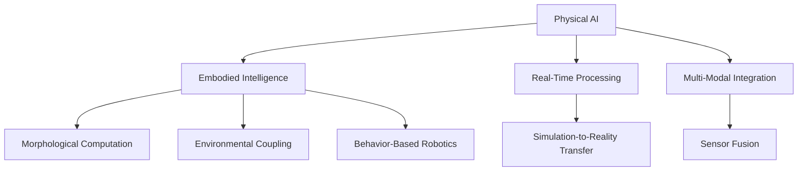

# Chapter 1: Key Concepts

## Core Concepts

### 1. Physical AI Definition
**Physical AI** is the field of artificial intelligence focused on systems that interact directly with the physical world. Unlike traditional AI that primarily operates on digital data, Physical AI systems are fundamentally intertwined with physical systems, their dynamics, and environmental interactions.

**Key Characteristics:**
- Embodiment: Intelligence arises from physical form and environmental interaction
- Dynamism: Real-time processing of continuously changing environments
- Uncertainty Management: Robust operation despite noise and incomplete information
- Multi-Modal Integration: Seamless fusion of diverse sensor modalities

### 2. Embodied Intelligence
The principle that intelligence emerges from the interaction between body, environment, and control system. This challenges traditional views that intelligence is purely computational.

**Components:**
- **Embodiment Hypothesis**: Intelligence emerges from body-environment-control system interaction
- **Morphological Computation**: Physical properties of the body can simplify control problems
- **Environmental Coupling**: Direct interaction between agent and environment shapes behavior

### 3. Traditional AI vs. Physical AI
| Aspect | Traditional AI | Physical AI |
|--------|----------------|-------------|
| Data Processing | Batch processing | Real-time processing |
| World Model | Explicit, symbolic | Implicit, learned |
| Reasoning Type | Discrete, symbolic | Continuous, analog |
| Error Handling | Discrete failure states | Continuous degradation |
| Time Constraints | Often relaxed | Strict real-time |
| Embodiment | Disembodied | Fundamental aspect |

## Technical Concepts

### 4. Behavior-Based Robotics
An approach emphasizing:
- Intelligence without explicit world models
- Real-time processing of sensor information
- Emergent behavior from simple rules
- Direct coupling between perception and action

### 5. Morphological Computation
The idea that physical systems perform computations through their morphological properties:

**Examples:**
- Passive dynamic walking exploiting mechanical properties and gravity
- Compliant mechanisms adapting to environmental variations without active control
- Material properties leveraged for sensing and actuation

### 6. Environmental Coupling
Physical AI systems are necessarily coupled to their environments through sensors and actuators, creating opportunities for:
- Information pickup through active exploration
- Exploitation of environmental affordances
- Emergence of adaptive behaviors
- Distributed computation between agent and environment

## Application Concepts

### 7. Physical AI Domains
Physical AI has transformative potential across numerous domains:

**Robotics Applications:**
- Autonomous Navigation
- Manipulation
- Human-Robot Interaction
- Swarm Robotics

**Industrial Applications:**
- Adaptive Assembly
- Quality Control
- Collaborative Robotics
- Predictive Maintenance

**Service Applications:**
- Healthcare Assistance
- Domestic Robots
- Educational Robotics
- Logistics

## Methodological Concepts

### 8. Simulation-to-Reality Transfer
The challenge of bridging the gap between simulated and real-world performance in Physical AI systems. Key techniques include:
- Domain randomization
- System identification
- Controller adaptation
- Validation methodologies

### 9. Multi-Modal Integration
The seamless fusion of diverse sensor modalities is crucial in Physical AI:
- Vision systems for perception
- Tactile sensing for manipulation
- Proprioception for self-awareness
- Auditory systems for interaction

### 10. Real-Time Processing
Physical AI systems must operate under strict timing constraints:
- Sensor data processing at high frequency
- Control system response within time limits
- Decision making in dynamic environments
- Safety-critical timing requirements

## Advanced Concepts

### 11. Foundation Models for Physical Systems
Large-scale models trained on diverse physical interactions, enabling transfer learning across different physical tasks and environments.

### 12. Embodied Language Models
Integration of language understanding with physical interaction, enabling more natural human-robot communication.

### 13. Neuromorphic Physical AI
Hardware and algorithms inspired by biological nervous systems, potentially offering more efficient and adaptive physical intelligence.

## Key Terms Glossary

- **Affordance**: A property of an object or environment that suggests how it can be interacted with
- **Embodiment**: The physical form of an intelligent system that influences and shapes its behavior
- **Morphological Computation**: Computation that occurs through the physical properties of a system
- **Environmental Coupling**: The direct connection between an agent and its environment through sensors and actuators
- **Simulation-to-Reality Transfer**: The process of applying knowledge gained in simulation to real-world systems
- **Domain Randomization**: A technique that randomizes simulation parameters to improve sim-to-real transfer
- **Embodied Cognition**: The theory that cognitive processes are influenced by the body's interactions with the environment

## Concept Relationships

## Learning Progression

1. **Foundation**: Understanding the definition and scope of Physical AI
2. **Historical Context**: Evolution from traditional AI to embodied cognition
3. **Core Principles**: Embodiment, morphological computation, environmental coupling
4. **Applications**: Real-world domains where Physical AI applies
5. **Technical Implementation**: How to build Physical AI systems
6. **Future Directions**: Emerging trends and research areas