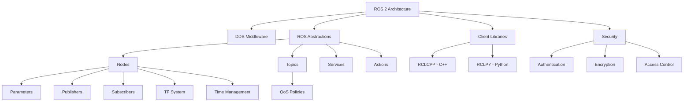

# Chapter 2: Key Concepts

## Core Architecture Concepts

### 1. ROS 2 Architecture
The fundamental architecture of ROS 2 is built around DDS (Data Distribution Service) as the communication middleware, providing real-time capabilities and improved robustness compared to ROS 1.

**Key Components:**
- **Nodes**: Execution units that perform computation tasks
- **DDS Implementation**: Underlying communication middleware (Fast DDS, Cyclone DDS, RTI Connext)
- **Client Libraries**: Language-specific interfaces (rclcpp for C++, rclpy for Python)
- **ROS Abstractions**: Topics, services, actions, parameters, and other ROS-specific concepts

### 2. DDS (Data Distribution Service) Integration
DDS is an OMG (Object Management Group) standard for real-time, high-performance data connectivity. ROS 2's integration with DDS provides:

**Advantages:**
- Real-time capabilities with deterministic message delivery
- Platform independence and language neutrality
- Built-in fault tolerance mechanisms
- Security features including authentication and encryption

### 3. Quality of Service (QoS) Policies
QoS policies allow fine-tuning of communication behavior to match application requirements:

**Core Policies:**
- **Reliability**: Best effort vs. reliable delivery
- **Durability**: Volatile vs. transient local data persistence
- **History**: Keep all vs. keep last N messages
- **Liveliness**: Deadline-based vs. manual vs. automatic liveliness checks
- **Deadline**: Maximum time between consecutive message deliveries
- **Depth**: Size of the message queue

## Communication Primitives

### 4. Nodes
Nodes are the fundamental units of computation in ROS 2, encapsulating:
- Parameters: Configurable values that can be changed at runtime
- Publishers: Interfaces for sending messages to topics
- Subscribers: Interfaces for receiving messages from topics
- Services: Server and client interfaces for request-response communication
- Actions: Interfaces for long-running tasks with feedback

### 5. Topics and Publishers/Subscribers
The publish-subscribe model forms the backbone of ROS 2 communication:
- Publishers send messages to topics
- Subscribers receive messages from topics
- Promotes loose coupling between components
- Enables flexible system architecture

**Implementation Considerations:**
- Message serialization and deserialization
- Network discovery and connection establishment
- Backpressure and flow control
- Type checking and interface compliance

### 6. Services and Clients
Request-response communication pattern ideal for operations requiring immediate responses:
- Synchronous communication model
- Request-response message pairs
- Error handling and status reporting
- Suitable for blocking operations

### 7. Actions
Asynchronous communication for long-running tasks with feedback:
- Goal-Feedback-Result communication pattern
- Cancel capability for long-running operations
- State management for task execution
- Suitable for navigation, manipulation, and other extended tasks

## Build and Package Management

### 8. Package Structure
Standardized structure for consistent development and deployment:

```
my_robot_package/
├── CMakeLists.txt          # Build instructions for C++ packages
├── package.xml             # Package metadata and dependencies
├── src/                    # Source code files
├── include/my_robot_package/   # Header files
├── launch/                 # Launch files for starting multiple nodes
├── config/                 # Configuration files
├── test/                   # Test files
└── scripts/                # Python scripts
```

### 9. Colcon Build System
The build tool for ROS 2, replacing catkin:

**Features:**
- Parallel building for faster compilation
- Multi-platform support across operating systems
- Flexible building supporting various build systems
- Dependency resolution and management

**Key Commands:**
- `colcon build`: Build all packages in the workspace
- `colcon build --packages-select <pkg>`: Build specific packages
- `colcon test`: Run tests for packages
- `colcon build --symlink-install`: Build with symlinks for development

## Advanced Features

### 10. TF (Transform) System
The transformation library for managing coordinate frames:

**Core Functions:**
- Coordinate frame management
- Transformation lookup and interpolation
- Time-varying transformations
- Multi-threaded safe access

**Implementation:**
- Transform broadcaster for publishing transforms
- Transform listener for querying transforms
- Buffer management for historical data
- Message filtering and interpolation

### 11. Time and Time Handling
Sophisticated time management for robotics applications:

**Time Sources:**
- System time: Real-world wall clock time
- Simulation time: Time from simulation environments
- Steady time: Monotonic time for performance measurements

**Use Cases:**
- Synchronization across distributed systems
- Timestamping of sensor data
- Time-based coordination between nodes
- Real-time deadline management

### 12. Parameters and Configuration
Unified parameter system for runtime configuration:

**Features:**
- Dynamic parameter reconfiguration
- Parameter validation and callbacks
- Hierarchical parameter organization
- Type safety and documentation

## Security and Real-time Features

### 13. Security Features
Built-in security features for production environments:

**Components:**
- Authentication: Verifying node identities
- Encryption: Protecting message contents
- Access control: Managing communication permissions
- Security policies: Configurable security enforcement

### 14. Real-time Capabilities
Design features for real-time system requirements:

**Capabilities:**
- Real-time scheduling support (SCHED_FIFO, SCHED_RR)
- Memory management techniques to avoid allocation
- Message prioritization through QoS policies
- Deterministic communication behavior

### 15. Lifecycle Nodes
State management for complex systems:

**States:**
- Unconfigured: Initial state
- Inactive: Configured but not running
- Active: Operational state
- Finalized: Cleaned up state

## Technical Glossary

- **DDS (Data Distribution Service)**: OMG standard for real-time data connectivity middleware
- **QoS (Quality of Service)**: Policies controlling communication behavior
- **RCL (ROS Client Library)**: Language-specific ROS interfaces
- **RMW (ROS Middleware)**: Interface between ROS and DDS implementations
- **TF (Transform)**: Library for coordinate frame management
- **Colcon**: Build system for ROS 2 packages
- **AMENT**: Build system framework used in ROS 2

## Concept Relationships



## Key Implementation Patterns

### 16. Node Design Patterns
- **Minimal Node**: Basic node structure with essential components
- **Component Node**: Modular design with multiple functional units
- **Lifecycle Node**: State-managed nodes for complex initialization
- **Composed Node**: Multiple nodes in a single process

### 17. Communication Design Patterns
- **Publisher-Subscriber**: Data distribution pattern
- **Service-Client**: Request-response pattern
- **Action-Client**: Asynchronous long-running pattern
- **Parameter Interface**: Configuration management pattern

## Performance Considerations

### 18. Performance Optimization
- Message serialization efficiency
- Network bandwidth utilization
- Memory allocation minimization
- Communication latency reduction
- CPU usage optimization

### 19. Best Practices
- Proper QoS policy selection
- Efficient message design
- Appropriate node granularity
- Resource management
- Error handling and recovery