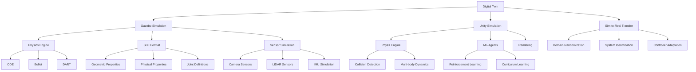

# Chapter 3: Key Concepts

## Digital Twin Fundamentals

### 1. Digital Twin Definition in Robotics
A digital twin in robotics is a virtual replica of a physical robot or system that serves as a bridge between the physical and digital worlds, enabling:

**Core Components:**
- **Physical Fidelity**: Accurate representation of physical properties and dynamics
- **Sensor Simulation**: Realistic modeling of sensors and perception systems
- **Environmental Modeling**: Accurate representation of the robot's operating environment
- **Real-time Synchronization**: Capability to update based on physical system state
- **Predictive Capabilities**: Ability to forecast system behavior under different conditions

### 2. Role in Physical AI
Digital twins are particularly important in Physical AI because they enable:
- Embodied learning through interaction with virtual environments
- Sim-to-real transfer of learned skills and behaviors
- Safe testing of dangerous scenarios
- Cost reduction during development

## Gazebo Simulation Environment

### 3. Physics Engine Capabilities
Gazebo supports multiple physics engines, each with distinct characteristics:

**Engine Options:**
- **ODE (Open Dynamics Engine)**: Balanced performance and accuracy for most applications
- **Bullet**: High-performance with excellent collision detection
- **DART**: Advanced constraint-based dynamics
- **Simbody**: Multi-body dynamics for biomechanics applications

### 4. SDF (Simulation Description Format)
XML-based format for describing simulation environments with elements:
- **Geometric Properties**: Shape, size, and visual appearance
- **Physical Properties**: Mass, inertia, friction coefficients
- **Joint Definitions**: Types, limits, and dynamics
- **Sensor Configurations**: Types, parameters, and mounting positions

### 5. Sensor Simulation in Gazebo
Realistic simulation of critical sensor types:
- **Camera Sensors**: RGB, depth, stereo cameras with noise models
- **LIDAR**: 2D and 3D laser scanners with configurable parameters
- **IMU**: Inertial measurement units with drift and noise simulation
- **Force/Torque Sensors**: Joint-level force measurements
- **GPS**: Global positioning system simulation
- **Contact Sensors**: Physical contact detection

### 6. ROS 2 Integration
Seamless integration through Gazebo ROS packages:
- **Bridge Nodes**: Message conversion between Gazebo and ROS formats
- **Launch System Integration**: Starting both Gazebo and ROS nodes simultaneously
- **Parameter Management**: Configuring simulation through ROS
- **Plugin System**: Extending Gazebo with ROS interfaces

## Unity Simulation Environment

### 7. Unity ML-Agents Toolkit
Enables robotics research and development with features:
- **Reinforcement Learning Support**: Built-in algorithms for environmental interaction
- **Curriculum Learning**: Progressive difficulty increase for complex tasks
- **Multi-Agent Simulation**: Support for multiple interacting agents
- **Environment Variability**: Tools for creating diverse training environments

### 8. PhysX Physics Engine
Unity's physics engine provides:
- **Realistic Collision Detection**: Advanced contact simulation algorithms
- **Multi-body Dynamics**: Complex interactions between articulated bodies
- **Soft Body Physics**: Simulation of deformable objects
- **Fluid Simulation**: Integration with NVIDIA's FLIP fluid solver

### 9. High-Quality Rendering
Unity's rendering capabilities include:
- **High Dynamic Range Imaging**: Realistic lighting and reflections
- **Physically Based Rendering**: Accurate material properties
- **Dynamic Lighting**: Real-time shadows and lighting effects
- **Atmospheric Effects**: Realistic environmental conditions

## Simulation Comparison Framework

### 10. Technical Comparison Factors
Key factors when comparing simulation environments:

| Factor | Gazebo | Unity |
|--------|--------|-------|
| Physics Accuracy | High (Multiple engines) | High (PhysX) |
| Graphics Quality | Moderate | Very High |
| Learning Curve | Moderate | Moderate to High |
| ROS Integration | Excellent | Good (with plugins) |
| Performance | High (Optimized for robotics) | Moderate to High |
| Open Source | Yes | No (Free version available) |
| Real-time Simulation | Excellent | Good |

### 11. Use Case Scenarios
**Gazebo Preferred For:**
- High-fidelity dynamics simulation
- Real-time robotics applications
- ROS-native workflows
- Control algorithm development
- Multi-robot systems

**Unity Preferred For:**
- Computer vision training
- Human-robot interaction
- High-quality visualization
- AR/VR integration
- Gaming-style environments

### 12. Performance Considerations
Critical factors in simulation performance:
- **Simulation Speed**: Gazebo typically offers faster simulation rates
- **Physics Fidelity**: Both offer high-fidelity with different strengths
- **Integration Complexity**: Gazebo has deeper ROS integration
- **Realism vs. Performance**: Graphics overhead in Unity

## Sim-to-Real Transfer

### 13. Domain Randomization
Technique for improving sim-to-real transfer by randomizing simulation parameters:
- **Physical Parameters**: Friction, mass, gravity variations
- **Visual Parameters**: Lighting, textures, colors
- **Sensor Parameters**: Noise levels, calibration variations
- **Environmental Parameters**: Obstacle configurations, layouts

### 14. System Identification
Techniques to calibrate simulation parameters:
- **Parameter Calibration**: Matching simulation to real-world behavior
- **Unknown Parameter Identification**: Discovering real-world system parameters
- **Dynamics Model Improvement**: Creating more accurate models

### 15. Controller Adaptation
Methods for adapting controllers from simulation to reality:
- **Gain Scheduling**: Adjusting parameters based on operating conditions
- **Adaptive Control**: Learning and adjusting to system changes
- **Robust Control**: Handling model uncertainty

## Technical Implementation Patterns

### 16. Gazebo Implementation Patterns
- **Model Plugins**: Extending robot model functionality
- **World Plugins**: Customizing environment behavior
- **Sensor Plugins**: Creating custom sensor types
- **Control Plugins**: Implementing robot controllers

### 17. Unity Implementation Patterns
- **ROS Connection Management**: Establishing and maintaining connections
- **Message Handling**: Processing ROS messages in Unity
- **Coordinate System Conversion**: Converting between Unity and ROS coordinates
- **Visualization Integration**: Combining simulation with real-world data

## Validation and Testing

### 18. Simulation Fidelity Assessment
Critical validation components:
- **Kinematic Validation**: Comparing forward and inverse kinematics
- **Dynamic Validation**: Validating mass, inertia, and friction parameters
- **Sensor Validation**: Comparing sensor outputs in simulation vs. reality
- **Control Validation**: Testing control algorithms in both environments

### 19. Performance Metrics
Key metrics for evaluating digital twin effectiveness:
- **Transfer Success Rate**: Percentage of simulation-learned skills that work in reality
- **Model Fidelity**: Closeness of simulation to real-world behavior
- **Sample Efficiency**: Training speed in simulation vs. real-world learning
- **Safety Coverage**: Range of safely testable scenarios in simulation

## Advanced Concepts

### 20. Multi-Environment Simulation
Strategies for using multiple simulation environments:
- **Parallel Simulation**: Running same scenarios in different environments
- **Sequential Simulation**: Progressive complexity from simple to complex
- **Hybrid Simulation**: Combining strengths of different environments

### 21. Digital Twin Lifecycle
The lifecycle of a digital twin implementation:
- **Design**: Creating the virtual replica
- **Development**: Implementing the simulation
- **Validation**: Ensuring accuracy and reliability
- **Deployment**: Using in the development process
- **Maintenance**: Updating with physical system changes

## Technical Glossary

- **Digital Twin**: Virtual replica of a physical system that bridges physical and digital worlds
- **SDF**: Simulation Description Format - XML format for describing simulation elements
- **URDF**: Unified Robot Description Format - XML format for robot models (ROS)
- **XACRO**: XML macro language for generating URDF files
- **ROS Bridge**: Components that enable ROS communication with simulation environments
- **Domain Randomization**: Technique for randomizing simulation parameters to improve transfer
- **System Identification**: Process of determining mathematical models from observed data
- **PhysX**: NVIDIA's physics engine used in Unity
- **ML-Agents**: Unity's machine learning agents toolkit

## Concept Relationships

## Best Practices

### 22. Simulation Development Best Practices
- **Model Accuracy**: Ensure geometric and physical properties match reality
- **Validation Planning**: Plan validation methodologies early in development
- **Performance Optimization**: Balance fidelity with simulation speed
- **Modular Design**: Create reusable and configurable simulation components
- **Documentation**: Maintain clear documentation of simulation assumptions and limitations