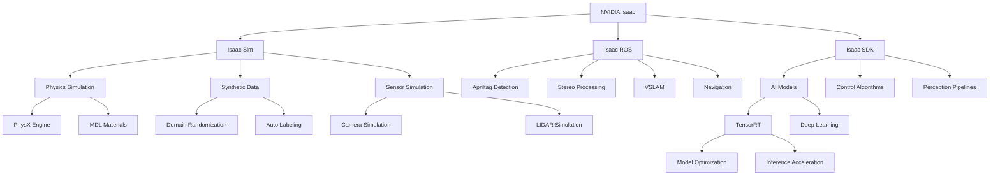

# Chapter 4: Key Concepts

## NVIDIA Isaac Platform Fundamentals

### 1. Isaac Platform Architecture
The NVIDIA Isaac platform provides a comprehensive ecosystem for AI-powered robotics with several key components:

**Core Components:**
- **Isaac Sim**: High-fidelity simulation environment built on Omniverse
- **Isaac ROS**: GPU-accelerated ROS packages for perception and navigation
- **Isaac SDK**: Software development kit with libraries for robot applications
- **Isaac Apps**: Pre-built applications for common robotics tasks
- **Deep Learning Models**: Pre-trained models optimized for robotics

### 2. GPU Acceleration in Robotics
Leveraging GPU computing for robotics applications provides significant advantages:

**Benefits:**
- **Parallel Processing**: GPUs excel at processing sensor data in parallel
- **Deep Learning Acceleration**: Tensor cores optimize AI model inference
- **Real-time Performance**: Dedicated hardware for time-critical tasks
- **Energy Efficiency**: Better performance per watt for AI workloads

## Isaac Sim Components

### 3. Advanced Physics Simulation
Isaac Sim incorporates multiple physics engines and advanced simulation techniques:

**Physics Engine Features:**
- **PhysX Engine**: NVIDIA's physics engine for accurate collision detection
- **Material Definition Language (MDL)**: High-fidelity materials for rendering
- **Path Tracing**: Physically accurate lighting simulation
- **Fluid Simulation**: Complex environmental interactions

### 4. Synthetic Data Generation
Key capability for training AI models using synthetic data:

**Generation Techniques:**
- **Domain Randomization**: Randomizing environment parameters for robustness
- **Variety of Scenarios**: Multiple lighting, textures, and object configurations
- **Automated Labeling**: Ground truth data generation for training
- **Noise Modeling**: Realistic sensor noise simulation

### 5. Sensor Simulation
Sophisticated modeling of real-world sensors:

**Sensor Types:**
- **Camera Simulation**: RGB, depth, stereo, fisheye with noise models
- **LIDAR Simulation**: 2D and 3D LIDAR with configurable specifications
- **IMU Simulation**: Inertial measurement units with drift and noise
- **Force/Torque Simulation**: Joint-level force sensors
- **GPS Simulation**: Position and velocity with realistic errors

## Isaac ROS Integration

### 6. Isaac ROS Package Suite
Collection of GPU-accelerated packages for robotics:

**Core Packages:**
- **Isaac ROS Apriltag**: GPU-accelerated AprilTag detection
- **Isaac ROS Stereo Image Proc**: Real-time stereo processing
- **Isaac ROS VSLAM**: Visual Simultaneous Localization and Mapping
- **Isaac ROS Navigation**: GPU-accelerated navigation stack
- **Isaac ROS Object Detection**: Real-time object detection

### 7. VSLAM (Visual SLAM)
GPU-accelerated visual SLAM capabilities:

**Key Features:**
- **Real-time Processing**: Leverages GPU parallelism for speed
- **Feature Detection**: GPU-accelerated keypoint detection
- **Pose Estimation**: Fast camera pose computation
- **Map Building**: GPU-accelerated map construction

### 8. Navigation Stack Optimization
GPU-accelerated navigation components:

**Optimized Components:**
- **Costmap Generation**: GPU-accelerated occupancy grid generation
- **Path Planning**: A* and Dijkstra algorithms on GPU
- **Local Planning**: Dynamic window approach acceleration
- **Recovery Behaviors**: GPU-accelerated recovery strategies

## AI and Deep Learning Integration

### 9. TensorRT for Robotics
NVIDIA's high-performance inference optimizer:

**Optimization Features:**
- **Model Quantization**: INT8 and FP16 optimizations
- **Kernel Fusion**: Combining operations for efficiency
- **Memory Optimization**: Efficient GPU memory usage
- **Multi-GPU Support**: Distributing workloads across GPUs

### 10. AI Model Deployment Pipeline
Process for deploying AI models in robotics:

**Pipeline Steps:**
- **Training**: Initial model training on datasets
- **Optimization**: TensorRT optimization for inference
- **Deployment**: Integration into robotic system
- **Execution**: Real-time inference in robot applications

### 11. Reinforcement Learning Framework
Support for reinforcement learning in robotics:

**Components:**
- **Environment Simulation**: Isaac Sim for training environments
- **Policy Networks**: Neural networks for decision making
- **Reward Functions**: Custom reward design for tasks
- **Training Algorithms**: DQN, PPO, SAC implementations

## Technical Implementation Patterns

### 12. Isaac Sim Integration Patterns
Best practices for integrating with Isaac Sim:

- **Scene Configuration**: Setting up environments for specific tasks
- **Robot Integration**: Adding robots with appropriate sensors
- **ROS Bridge**: Connecting simulation to ROS ecosystem
- **Data Logging**: Capturing training data from simulations

### 13. Perception Pipeline Patterns
Design patterns for AI-based perception:

- **Multi-sensor Fusion**: Combining data from multiple sensors
- **Real-time Processing**: Optimizing for time-critical applications
- **Model Selection**: Choosing appropriate models for tasks
- **Performance Optimization**: Balancing accuracy and speed

### 14. Control Integration Patterns
Methods for integrating AI with robot control:

- **Model Predictive Control**: AI-augmented control strategies
- **Behavior Trees**: Hierarchical task execution with AI
- **Adaptive Control**: AI-driven parameter adjustment
- **Safety Frameworks**: Ensuring safety with AI components

## Performance Considerations

### 15. Computational Requirements
Understanding resource needs for Isaac applications:

**Hardware Requirements:**
- **GPU Memory**: Sufficient VRAM for models and operations
- **Compute Capability**: CUDA-enabled GPU for acceleration
- **CPU Resources**: For non-GPU operations and coordination
- **Storage**: For models, data, and simulation assets

### 16. Real-time Performance Factors
Key considerations for real-time AI in robotics:

**Performance Metrics:**
- **Inference Latency**: Time for model inference
- **Throughput**: Frames per second processing
- **Power Consumption**: Energy efficiency considerations
- **Thermal Management**: Heat dissipation for embedded systems

## Advanced Concepts

### 17. Simulation Fidelity vs. Performance Trade-offs
Balancing accuracy and speed in simulation:

**Trade-off Areas:**
- **Physics Accuracy**: Detail level vs. computation time
- **Visual Fidelity**: Rendering quality vs. frame rate
- **Sensor Modeling**: Realism vs. computational overhead
- **Environment Complexity**: Detail vs. simulation speed

### 18. AI Safety in Robotics
Considerations for safe AI deployment:

**Safety Aspects:**
- **Model Robustness**: Handling out-of-distribution inputs
- **Fail-safe Mechanisms**: Graceful degradation strategies
- **Validation**: Testing models in various conditions
- **Monitoring**: Detecting model degradation in deployment

## Technical Glossary

- **TensorRT**: NVIDIA's high-performance inference optimizer
- **Isaac Sim**: NVIDIA's robot simulation environment built on Omniverse
- **PhysX**: NVIDIA's physics engine used in Isaac Sim
- **Domain Randomization**: Technique for improving sim-to-real transfer
- **VSLAM**: Visual Simultaneous Localization and Mapping
- **CUDA**: NVIDIA's parallel computing platform
- **Omniverse**: NVIDIA's platform for real-time collaboration and simulation
- **Isaac ROS**: GPU-accelerated ROS packages for robotics
- **Synthetic Data**: Artificially generated data for AI training
- **GPU Acceleration**: Using graphics processors for computation

## Concept Relationships

## Best Practices

### 19. Isaac Development Best Practices
- **Model Optimization**: Always optimize models with TensorRT for deployment
- **Simulation Validation**: Validate simulation results with real-world data
- **Performance Profiling**: Monitor GPU utilization and bottlenecks
- **Safety Integration**: Implement safety checks in AI decision-making
- **Modular Design**: Create reusable and configurable AI components
- **Documentation**: Maintain clear documentation of AI system behavior and limitations