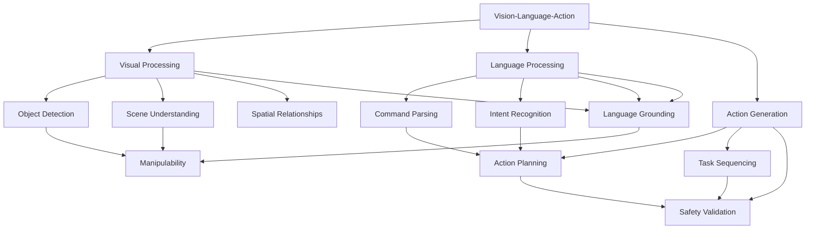

# Chapter 5: Key Concepts

## VLA System Fundamentals

### 1. Vision-Language-Action Integration
VLA systems tightly couple three critical modalities for intelligent robotic behavior:

**Integration Components:**
- **Visual Input**: Images, video, depth information, point clouds
- **Language Input**: Natural language commands, questions, descriptions
- **Action Output**: Motor commands, task plans, manipulation sequences

### 2. Multi-Modal Learning
The core challenge in VLA systems is creating representations that capture:

**Key Elements:**
- **Cross-Modal Alignment**: Understanding correspondences between visual and linguistic elements
- **Grounding**: Connecting abstract linguistic concepts to concrete visual/perceptual features
- **Embodied Understanding**: Learning concepts through physical interaction with the environment

## Vision Components

### 3. Visual Feature Extraction
Modern VLA systems use pre-trained vision models as backbones:

**Common Approaches:**
- **Vision Transformers (ViT)**: Attention-based visual processing
- **Convolutional Neural Networks**: Traditional image feature extraction
- **Vision-Language Models**: Jointly trained for cross-modal understanding

### 4. Scene Understanding
Beyond object detection, VLA systems analyze spatial relationships:

**Analysis Components:**
- **Object Detection**: Identifying entities in the scene
- **Spatial Relationships**: Understanding object positioning and interactions
- **Scene Context**: Recognizing environment and affordances
- **Manipulability Assessment**: Estimating feasibility of object interaction

### 5. Object Manipulation Analysis
Specialized processing for robotic interaction:

**Assessment Factors:**
- **Graspability**: Physical feasibility of grasping objects
- **Weight Estimation**: Predicting object mass for manipulation
- **Material Properties**: Understanding object composition and fragility
- **Stability Analysis**: Predicting outcomes of manipulation actions

## Language Components

### 6. Natural Language Processing in Robotics
Language understanding tailored for robotic applications:

**Processing Elements:**
- **Command Parsing**: Extracting action verbs and object references
- **Intent Recognition**: Understanding user goals and intentions
- **Spatial Language**: Processing location and orientation references
- **Temporal Language**: Understanding sequence and timing in instructions

### 7. Language Grounding
Connecting language concepts to visual/perceptual space:

**Grounding Mechanisms:**
- **Cross-Attention**: Language-guided visual feature selection
- **Referring Expression**: Connecting phrases to visual objects
- **Spatial Grounding**: Mapping language locations to coordinate spaces
- **Action Grounding**: Connecting verbs to robot capabilities

## Action Components

### 8. Action Space Representation
Representing robot actions that connect perception and physical capabilities:

**Action Types:**
- **Primitive Actions**: Basic robot capabilities (move, grasp, release)
- **Skill Sequences**: Combinations of primitives for complex tasks
- **Task Plans**: High-level sequences for goal achievement
- **Reactive Behaviors**: Conditional responses to sensor inputs

### 9. Task Planning and Execution
Higher-level planning that connects language commands to actions:

**Planning Elements:**
- **Task Decomposition**: Breaking complex commands into subtasks
- **Temporal Sequencing**: Ordering actions for goal achievement
- **Constraint Satisfaction**: Ensuring actions meet requirements
- **Replanning Mechanisms**: Adapting plans based on execution feedback

### 10. Action Generation Architecture
Neural architectures for generating robot commands:

**Architecture Components:**
- **Multimodal Fusion**: Combining vision and language features
- **Sequence Generation**: Creating temporal action sequences
- **Parameter Prediction**: Determining action parameters
- **Execution Validation**: Ensuring feasibility of planned actions

## Integration and Deployment

### 11. Real-time Processing Pipeline
Requirements for real-time VLA system operation:

**Pipeline Components:**
- **Input Synchronization**: Coordinating vision and language inputs
- **Asynchronous Processing**: Handling different processing times
- **Buffer Management**: Managing sensor and command data
- **Performance Optimization**: Ensuring real-time constraints

### 12. Safety and Validation
Critical safety considerations for VLA system deployment:

**Safety Mechanisms:**
- **Workspace Limit Validation**: Ensuring actions stay within safe boundaries
- **Collision Avoidance**: Preventing robot from hitting obstacles
- **Force Limiting**: Protecting robot and environment from damage
- **Emergency Stop**: Immediate action inhibition when needed

## Technical Implementation Patterns

### 13. Cross-Modal Fusion Patterns
Architectural approaches for combining vision and language:

- **Early Fusion**: Combining modalities at feature level
- **Late Fusion**: Combining at decision level
- **Attention-Based Fusion**: Using attention mechanisms to weight modalities
- **Hierarchical Fusion**: Combining at multiple levels of abstraction

### 14. Language-to-Action Mapping
Techniques for connecting natural language to robot commands:

- **Template-Based Parsing**: Using predefined command templates
- **Neural Sequence-to-Sequence**: Learning mappings with neural networks
- **Semantic Parsing**: Converting to structured representations
- **Reinforcement Learning**: Learning from interaction feedback

### 15. Vision-Guided Language Understanding
Approaches that use visual context to improve language understanding:

- **Visual Question Answering**: Answering questions about scenes
- **Referring Expression Comprehension**: Identifying objects mentioned in text
- **Spatial Language Understanding**: Understanding location references
- **Context-Aware Interpretation**: Using scene context to disambiguate commands

## Performance Considerations

### 16. Computational Requirements
Understanding resource needs for VLA systems:

**Hardware Requirements:**
- **GPU Memory**: Sufficient VRAM for vision and language models
- **Compute Power**: GPUs for real-time inference
- **Memory Bandwidth**: Fast access to model parameters
- **Storage**: For models, temporary data, and logs

### 17. Real-time Performance Factors
Key considerations for real-time VLA applications:

**Performance Metrics:**
- **Latency**: Time from input to action generation
- **Throughput**: Frames per second processing capability
- **Consistency**: Reliable timing for safety-critical applications
- **Reliability**: Consistent performance under varying conditions

## Advanced Concepts

### 18. Multimodal Representation Learning
Advanced techniques for learning joint vision-language representations:

**Learning Approaches:**
- **Contrastive Learning**: Learning representations by contrasting similar/dissimilar pairs
- **Masked Language Modeling**: Learning from partially observed inputs
- **Cross-Modal Pretraining**: Large-scale pretraining on multimodal datasets
- **Self-Supervised Learning**: Learning without explicit supervision

### 19. Embodied Learning
Learning through physical interaction and experience:

**Learning Paradigms:**
- **Learning from Demonstration**: Imitating human behaviors
- **Reinforcement Learning**: Learning through trial and error
- **Active Learning**: Robot choosing actions to improve learning
- **Transfer Learning**: Applying learned skills to new situations

## Technical Glossary

- **VLA (Vision-Language-Action)**: Systems that integrate visual perception, language understanding, and physical action
- **Cross-Modal Attention**: Attention mechanism that operates across different modalities
- **Language Grounding**: Connecting linguistic concepts to perceptual features
- **Referring Expressions**: Linguistic phrases that identify specific visual objects
- **Embodied AI**: AI systems that interact with the physical world
- **Multimodal Fusion**: Combining information from multiple sensory modalities
- **Task Planning**: Creating sequences of actions to achieve goals
- **Spatial Language**: Language describing locations and spatial relationships
- **Reactive Systems**: Systems that respond directly to environmental changes
- **Proactive Systems**: Systems that initiate actions based on learned behaviors

## Concept Relationships

## Best Practices

### 20. VLA System Development Best Practices
- **Modular Design**: Create independent components for easy testing and modification
- **Performance Monitoring**: Track real-time performance metrics during operation
- **Safety First**: Implement safety checks at all system levels
- **Robustness**: Design for handling ambiguous or incomplete inputs
- **Scalability**: Create systems that can handle increasing complexity
- **Validation**: Test thoroughly in simulation before real robot deployment