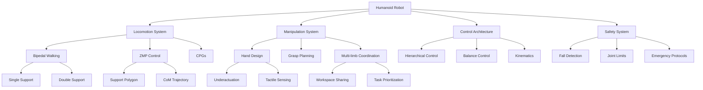

# Chapter 6: Key Concepts

## Humanoid Robot Design

### 1. Anthropomorphic Design Principles
Humanoid robots are designed to mimic human form and function, providing unique advantages and challenges:

**Design Considerations:**
- **Bipedal Locomotion**: Two-legged walking capability similar to humans
- **Upper Limb Manipulation**: Arms and hands designed for dexterous manipulation
- **Sensory Systems**: Vision, hearing, and tactile positioned similarly to humans
- **Communication Interface**: Face and body language for human-robot interaction

### 2. Degrees of Freedom (DOF) Architecture
The number and arrangement of joints significantly impact humanoid capabilities:

**Typical Configurations:**
- **Leg Joints**: 6 DOF per leg (hip, knee, ankle)
- **Arm Joints**: 7+ DOF per arm (shoulder, elbow, wrist)
- **Torso**: 3-6 DOF for upper body movement
- **Head**: 3 DOF for gaze and attention

### 3. Actuator Selection and Placement
Choosing appropriate actuators requires balancing power, precision, and safety:

**Actuator Types:**
- **Servo Motors**: High precision for manipulation tasks
- **Series Elastic Actuators (SEA)**: Compliant actuation for safe interaction
- **Pneumatic Muscles**: Human-like compliance and lightweight design
- **Hydraulic Actuators**: High power-to-weight ratio for heavy lifting

## Locomotion and Balance

### 4. Bipedal Walking Mechanics
Bipedal locomotion presents unique dynamic balance challenges:

**Walking Phases:**
- **Single Support**: One foot in contact with ground
- **Double Support**: Both feet in contact with ground
- **Swing Phase**: Leg moves forward without ground contact
- **Balance Control**: Maintaining center of mass within support polygon

### 5. Zero Moment Point (ZMP) Control
ZMP control is fundamental to humanoid balance during walking:

**ZMP Concepts:**
- **Definition**: Point where the moment of ground reaction force equals zero
- **Balance Condition**: ZMP must lie within the support polygon for stability
- **Control Strategy**: Manipulate CoM trajectory to control ZMP position
- **Support Polygon**: Convex hull of ground contact points

### 6. Gait Pattern Generation
Creating stable walking patterns requires sophisticated trajectory planning:

**Pattern Elements:**
- **Foot Placement**: Strategic positioning for balance
- **Swing Trajectory**: Smooth, obstacle-avoiding leg movement
- **Timing Coordination**: Proper phasing of double and single support
- **Adaptability**: On-the-fly adjustments for disturbances

### 7. Central Pattern Generators (CPGs)
Neural network models that produce rhythmic patterns for locomotion:

**CPG Features:**
- **Rhythmic Patterns**: Self-sustaining oscillatory behavior
- **Coupling Mechanisms**: Coordination between limb oscillators
- **Adaptive Control**: Response to sensory feedback
- **Robustness**: Stable patterns despite parameter variations

## Manipulation and Dexterity

### 8. Anthropomorphic Hand Design
Creating dexterous hands remains one of robotics' greatest challenges:

**Design Approaches:**
- **Underactuation**: Fewer actuators than degrees of freedom
- **Tendon-driven**: Mimicking human muscle-tendon systems
- **Compliant Mechanisms**: Built-in compliance for safe interaction
- **Tactile Sensing**: Feedback for grasp stability and object properties

### 9. Grasp Planning and Execution
Algorithms for determining stable and effective grasps:

**Planning Components:**
- **Geometric Analysis**: Surface properties and object shape
- **Force Closure**: Ensuring grasp stability under loads
- **Approach Planning**: Collision-free hand positioning
- **Grasp Types**: Precision, power, and specialized grasp modes

### 10. Multi-limb Coordination
Coordinating movements across multiple limbs requires sophisticated control:

**Coordination Elements:**
- **Task Prioritization**: Resolving conflicts between simultaneous tasks
- **Workspace Sharing**: Managing shared operational spaces
- **Temporal Scheduling**: Coordinating timing of different limb movements
- **Load Distribution**: Balancing loads across multiple limbs

## Control Architectures

### 11. Hierarchical Control Systems
Humanoid robots require control at multiple organizational levels:

**Control Levels:**
- **High-level Planning**: Task planning and sequencing
- **Mid-level Control**: Trajectory generation and coordination
- **Low-level Control**: Joint servo control and feedback
- **Safety Systems**: Emergency stops and collision avoidance

### 12. Dynamic Balance Control
Maintaining balance during complex movements and external disturbances:

**Balance Control Aspects:**
- **Center of Mass (CoM)**: Managing CoM position and velocity
- **Angular Momentum**: Controlling rotational dynamics
- **Disturbance Rejection**: Responding to external perturbations
- **Recovery Strategies**: Regaining balance from disturbances

## Safety and Reliability

### 13. Humanoid Safety Systems
Safety is paramount due to close human-robot interaction:

**Safety Components:**
- **Joint Limits**: Preventing damage from excessive motion
- **Force Limits**: Protecting from excessive interaction forces
- **Collision Detection**: Avoiding harmful contacts
- **Emergency Protocols**: Safe stopping procedures

### 14. Fall Detection and Recovery
Critical systems for preventing and managing falls:

**Fall Management:**
- **Detection Algorithms**: Identifying impending falls
- **Recovery Strategies**: Active responses to maintain balance
- **Safe Landing**: Minimizing damage if fall occurs
- **Recovery from Fall**: Getting back to standing position

## Technical Implementation Patterns

### 15. Humanoid Kinematics
Specialized approaches for humanoid robot kinematics:

- **Forward Kinematics**: Computing end-effector positions from joint angles
- **Inverse Kinematics**: Computing joint angles for desired positions
- **Whole-Body IK**: Coordinating multiple end-effectors and balance
- **Jacobian-based Control**: Managing velocity and force control

### 16. Balance Control Strategies
Different approaches to maintaining humanoid balance:

- **ZMP-based Control**: Classical approach using Zero Moment Point
- **Capture Point**: Predicting where to step to stop motion
- **Angular Momentum**: Controlling rotational dynamics
- **Whole-Body Control**: Optimization-based methods

### 17. Manipulation Control
Techniques for dexterous manipulation:

- **Impedance Control**: Controlling interaction with environment
- **Force Control**: Managing forces during contact tasks
- **Compliant Control**: Adapting to environmental constraints
- **Tactile Feedback**: Using touch sensing for control

## Performance Considerations

### 18. Computational Requirements
Understanding processing needs for humanoid systems:

**Resource Demands:**
- **Real-time Processing**: Control loops at 100Hz or higher
- **Perception Processing**: Vision, audio, and sensor fusion
- **Motion Planning**: Trajectory generation and optimization
- **Safety Monitoring**: Continuous system state assessment

### 19. Power and Energy Management
Critical for mobile humanoid operation:

**Power Considerations:**
- **Actuator Power**: High power needs for human-like motion
- **Battery Management**: Optimizing for operational duration
- **Energy Efficiency**: Minimizing power consumption
- **Thermal Management**: Heat dissipation from active systems

## Advanced Concepts

### 20. Learning and Adaptation
Modern humanoid robots incorporate learning capabilities:

**Learning Paradigms:**
- **Learning from Demonstration**: Imitating human behaviors
- **Reinforcement Learning**: Learning through interaction
- **Adaptive Control**: Adjusting parameters to changing conditions
- **Transfer Learning**: Applying learned skills to new situations

### 21. Human-Robot Interaction
Designing for effective human-robot collaboration:

**Interaction Elements:**
- **Social Cues**: Appropriate body language and expressions
- **Communication**: Natural language and gesture integration
- **Trust Building**: Reliable and predictable behavior
- **Cultural Sensitivity**: Appropriate behavior across cultures

## Technical Glossary

- **DOF (Degrees of Freedom)**: Number of independent joint movements
- **ZMP (Zero Moment Point)**: Point where ground reaction moment is zero
- **CPG (Central Pattern Generator)**: Neural circuit producing rhythmic patterns
- **CoM (Center of Mass)**: Point where mass is concentrated
- **Underactuation**: Having fewer actuators than system degrees of freedom
- **Force Closure**: Grasp configuration that can resist any direction of force
- **Support Polygon**: Area where robot feet contact ground
- **Whole-Body Control**: Controlling all robot joints simultaneously
- **Impedance Control**: Controlling relationship between force and position
- **Capture Point**: Location where robot needs to step to come to stop

## Concept Relationships

## Best Practices

### 22. Humanoid Development Best Practices
- **Modular Design**: Create independent components for easier development and testing
- **Safety First**: Implement comprehensive safety systems at all levels
- **Real-time Performance**: Ensure all control loops meet timing requirements
- **Robustness**: Design for handling unexpected situations
- **Scalability**: Create systems that can be extended to new capabilities
- **Validation**: Test thoroughly in simulation before real robot deployment