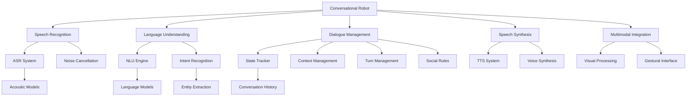

# Chapter 7: Key Concepts

## Conversational AI Fundamentals

### 1. Core Components of Conversational Robotics
Conversational robots integrate multiple AI technologies to enable natural interaction:

**System Components:**
- **Automatic Speech Recognition (ASR)**: Converts spoken language to text
- **Natural Language Understanding (NLU)**: Interprets the meaning of text input
- **Dialogue Manager**: Maintains conversation state and manages turn-taking
- **Natural Language Generation (NLG)**: Creates natural language responses
- **Text-to-Speech (TTS)**: Converts text responses to spoken output
- **Multimodal Integration**: Combines speech with visual and other sensory information

### 2. Dialogue State Management
Maintaining context across multiple conversational turns is essential for natural interaction:

**State Elements:**
- **Conversation History**: Previous turns in the dialogue
- **Current Intent**: User's current goal or purpose
- **Entities**: Specific objects, locations, or concepts mentioned
- **User Profile**: Personal preferences and history
- **Session Context**: Current task or ongoing activity
- **Temporal Context**: Timing and sequence of interactions

## Speech Recognition and Synthesis

### 3. Automatic Speech Recognition (ASR)
Advanced speech recognition systems enable robots to understand human speech in various conditions:

**ASR Components:**
- **Acoustic Models**: Mapping audio signals to phonemes
- **Language Models**: Understanding text patterns and grammar
- **Decoder**: Combining acoustic and language models
- **Adaptation Systems**: Adjusting to different speakers and conditions
- **Noise Cancellation**: Filtering environmental noise

### 4. Text-to-Speech (TTS)
Speech synthesis systems convert text to natural-sounding speech:

**TTS Technologies:**
- **Concatenative Synthesis**: Joining pre-recorded speech segments
- **Parametric Synthesis**: Generating speech from mathematical models
- **Neural TTS**: Using deep learning models for natural speech
- **Voice Personalization**: Customizing voice characteristics
- **Emotional Speech**: Adding prosodic features for expression

## Dialogue Management

### 5. Intent Recognition and Classification
Understanding user goals and purposes is fundamental to conversational systems:

**Intent Categories:**
- **Information Requests**: Asking for knowledge or data
- **Navigation Commands**: Directing robot movement
- **Object Interaction**: Requesting manipulation tasks
- **Social Interaction**: Engaging in social conversation
- **System Control**: Managing robot behavior and settings

### 6. Slot Filling and Entity Extraction
Extracting specific information needed to fulfill user requests:

**Slot Types:**
- **Location Slots**: Destinations for navigation
- **Object Slots**: Items for manipulation
- **Time Slots**: Scheduling and timing information
- **Person Slots**: People for identification
- **Action Slots**: Specific actions to perform

### 7. Dialogue Flow Management
Controlling the turn-taking and direction of conversations:

**Flow Patterns:**
- **Command-Based**: User gives commands, robot executes
- **Collaborative**: Shared decision-making process
- **Information-Seeking**: Clarification and confirmation
- **Social Chitchat**: Casual social interaction
- **Task-Oriented**: Focused on specific goals

## Multimodal Interaction

### 8. Multimodal Integration
Combining multiple sensory inputs and outputs for richer interaction:

**Integration Elements:**
- **Speech-Vision Fusion**: Linking language to visual objects
- **Gestural Communication**: Hand and body movements
- **Context Awareness**: Understanding environmental context
- **Attention Management**: Directing robot focus appropriately
- **Turn-Taking Signals**: Managing conversation flow

### 9. Social Robotics Principles
Designing robots for appropriate social interaction:

**Social Rules:**
- **Personal Space**: Respecting appropriate distances
- **Greeting Protocols**: Appropriate opening and closing interactions
- **Attention Management**: Courteous focus shifting
- **Cultural Sensitivity**: Adapting to cultural norms
- **Emotional Expression**: Appropriate responses to user emotions

## Technical Implementation Patterns

### 10. Speech Recognition in Robotics
Specialized approaches for robot applications:

- **Keyword Spotting**: Detecting wake words and commands
- **Noise Robustness**: Handling environmental noise
- **Real-time Processing**: Meeting conversational timing requirements
- **Multi-microphone Arrays**: Spatial audio processing
- **Speaker Identification**: Recognizing different users

### 11. Dialogue System Architectures
Different approaches to organizing conversational systems:

- **Rule-based Systems**: Hand-crafted dialogue rules
- **Statistical Systems**: Data-driven response generation
- **Neural Systems**: End-to-end learning models
- **Hybrid Systems**: Combining multiple approaches
- **Reinforcement Learning**: Learning from interaction feedback

### 12. Multimodal Perception Integration
Combining speech with other sensory modalities:

- **Visual Grounding**: Connecting language to visual objects
- **Audio-Visual Synchronization**: Coordinating different modalities
- **Contextual Understanding**: Using environment for disambiguation
- **Cross-modal Attention**: Focusing on relevant inputs
- **Sensor Fusion**: Combining diverse sensory information

## Performance Considerations

### 13. Real-time Processing Requirements
Conversational systems must meet strict timing constraints:

**Performance Metrics:**
- **Latency**: Response time to user input
- **Throughput**: Processing capacity under load
- **Robustness**: Performance in challenging conditions
- **Reliability**: Consistent operation over time
- **Scalability**: Supporting multiple users

### 14. User Experience Factors
Creating positive interaction experiences:

**UX Elements:**
- **Naturalness**: Responses that feel human-like
- **Helpfulness**: Providing useful information
- **Efficiency**: Minimizing interaction effort
- **Personalization**: Adapting to individual users
- **Trust Building**: Reliable and predictable behavior

## Advanced Concepts

### 15. Learning and Adaptation
Modern conversational systems that improve over time:

**Adaptation Methods:**
- **Online Learning**: Updating during interaction
- **Personalization**: Adapting to individual users
- **Transfer Learning**: Applying knowledge to new domains
- **Active Learning**: Selecting informative training examples
- **Reinforcement Learning**: Learning from feedback

### 16. Privacy and Ethics
Important considerations for conversational systems:

**Privacy Aspects:**
- **Data Collection**: What information is stored
- **Consent**: User permission for data use
- **Anonymization**: Protecting user identity
- **Security**: Preventing unauthorized access
- **Transparency**: Clear communication about system capabilities

## Technical Glossary

- **ASR (Automatic Speech Recognition)**: Technology that converts speech to text
- **NLU (Natural Language Understanding)**: Technology that interprets text meaning
- **NLG (Natural Language Generation)**: Technology that creates text responses
- **TTS (Text-to-Speech)**: Technology that converts text to spoken output
- **Dialogue State**: Information about current conversation context
- **Intent Recognition**: Identifying the purpose of user input
- **Slot Filling**: Extracting specific information from input
- **Multimodal**: Using multiple sensory modalities
- **Turn-taking**: Managing who speaks when in conversation
- **Visual Grounding**: Connecting language to visual elements
- **Social Cues**: Non-verbal signals in communication
- **Context Awareness**: Understanding environmental context
- **Wake Word**: Special phrase to activate system
- **Speech Synthesis**: Creating artificial speech
- **Prosody**: Rhythm, stress, and intonation in speech

## Concept Relationships

## Best Practices

### 17. Conversational System Development Best Practices
- **User-Centered Design**: Focus on user needs and preferences
- **Robustness**: Handle errors gracefully and provide helpful feedback
- **Privacy Protection**: Implement strong data protection measures
- **Cultural Sensitivity**: Adapt to diverse user backgrounds
- **Accessibility**: Support users with different abilities
- **Continuous Improvement**: Learn from user interactions
- **Safety First**: Ensure systems respond appropriately in all scenarios