# Chapter 8: Key Concepts

## System Integration Overview

### 1. Integrated System Architecture
The autonomous humanoid brings together all components from previous chapters into a unified architecture:

**Integration Elements:**
- **Physical AI Foundation**: Embodiment, multi-modal integration, real-time processing
- **Communication Layer**: ROS 2 nodes, topics, services, actions, TF system
- **Digital Twin**: Simulation, testing, and development environment
- **AI-robot Brain**: Perception, planning, and control capabilities
- **VLA Integration**: Vision-Language-Action coordination
- **Humanoid Control**: Locomotion, manipulation, and balance
- **Conversational AI**: Natural language interaction and understanding

### 2. System State Management
Comprehensive state management across all integrated components:

**State Categories:**
- **System State**: Overall operational state (initializing, ready, executing, emergency)
- **Subsystems State**: Individual component operational status
- **Task State**: Current task execution and progress
- **Safety State**: Safety system status and constraints
- **Resource State**: Computational and physical resource availability

## Implementation Strategy

### 3. Step-by-Step Integration Approach
Systematic integration methodology for complex robotic systems:

**Integration Phases:**
- **Phase 1**: Individual subsystem verification and testing
- **Phase 2**: Pairwise subsystem integration and interface validation
- **Phase 3**: Layered integration building up functionality
- **Phase 4**: Full system integration and validation
- **Phase 5**: Optimization and deployment preparation

### 4. Resource Management
Coordinated resource allocation across all subsystems:

**Resource Types:**
- **Computational Resources**: CPU, GPU, memory allocation
- **Communication Resources**: Bandwidth and message prioritization
- **Power Resources**: Energy consumption and battery management
- **Physical Resources**: Joint limits, workspace constraints
- **Time Resources**: Real-time scheduling and timing constraints

## Complex Task Execution

### 5. Multimodal Task Coordination
Coordinating multiple subsystems for complex tasks:

**Coordination Elements:**
- **Task Planning**: High-level task decomposition and sequencing
- **Resource Allocation**: Dynamic allocation of resources during tasks
- **Synchronization**: Coordinating timing between subsystems
- **Feedback Integration**: Combining feedback from multiple sources
- **Adaptive Execution**: Adjusting execution based on real-time feedback

### 6. Performance Evaluation Metrics
Comprehensive metrics for evaluating integrated system performance:

**Performance Categories:**
- **Functional Performance**: Task completion success rates
- **Timing Performance**: Real-time behavior and latency
- **Resource Performance**: Efficiency of resource utilization
- **Safety Performance**: Safety system effectiveness and response
- **User Experience Performance**: Interaction quality and satisfaction

## Deployment Considerations

### 7. Deployment Readiness Factors
Critical factors for successful real-world deployment:

**Readiness Elements:**
- **Environmental Suitability**: Physical and operational environment compatibility
- **Safety Compliance**: Meeting safety standards and regulations
- **Maintenance Requirements**: Serviceability and maintenance needs
- **User Training**: Required user knowledge and capabilities
- **Support Infrastructure**: Technical support and update capabilities

### 8. Safety and Reliability
Comprehensive safety systems for integrated robotic platforms:

**Safety Components:**
- **Emergency Response**: Immediate response to safety-critical situations
- **Collision Avoidance**: Proactive avoidance of collisions and hazards
- **Failure Mitigation**: Graceful handling of component failures
- **Human Safety**: Protection of humans in robot operating area
- **System Integrity**: Maintaining system reliability and security

## Technical Implementation Patterns

### 9. Integration Architecture Patterns
Different approaches to integrating complex robotic systems:

- **Centralized Architecture**: Single controller coordinating all subsystems
- **Distributed Architecture**: Subsystems coordinate through shared interfaces
- **Layered Architecture**: Hierarchical organization of subsystems
- **Event-Driven Architecture**: Subsystems react to events and messages
- **Service-Oriented Architecture**: Subsystems provide services to each other

### 10. Debugging and Troubleshooting Strategies
Advanced techniques for debugging integrated systems:

- **Comprehensive Logging**: Cross-subsystem event correlation
- **Performance Monitoring**: Real-time system health tracking
- **Isolation Testing**: Testing subsystems independently
- **Incremental Integration**: Adding subsystems gradually
- **Automated Testing**: Continuous integration and validation

### 11. Performance Optimization Techniques
Methods for optimizing integrated system performance:

- **Resource Allocation**: Dynamic allocation based on current needs
- **Load Balancing**: Distributing computational load across resources
- **Caching Strategies**: Caching results to improve response time
- **Preemption Management**: Handling real-time task priorities
- **Efficiency Monitoring**: Continuous optimization based on usage patterns

## Performance Considerations

### 12. Real-time Integration Challenges
Managing real-time requirements across integrated subsystems:

**Timing Constraints:**
- **Control Loop Frequencies**: Different subsystems have different timing needs
- **Communication Latency**: Message passing delays between subsystems
- **Processing Time Variations**: Different tasks have different computational needs
- **Safety Response Time**: Critical timing for safety system responses
- **User Interaction Timing**: Natural timing for human-robot interactions

### 13. Scalability Factors
Design considerations for system growth and evolution:

**Scalability Elements:**
- **Hardware Scalability**: Ability to add computational resources
- **Software Scalability**: Ability to add new capabilities
- **Task Complexity**: Handling increasingly complex tasks
- **Environment Complexity**: Operating in more challenging environments
- **Multi-robot Coordination**: Potential for multiple robot coordination

## Advanced Concepts

### 14. Continuous Learning and Adaptation
Systems that improve over time through interaction:

**Learning Approaches:**
- **Online Learning**: Learning during normal operation
- **Experience-Based Adaptation**: Improving based on interaction history
- **Transfer Learning**: Applying learned knowledge to new situations
- **User Preference Learning**: Adapting to individual user preferences
- **Environmental Adaptation**: Adjusting to changing environmental conditions

### 15. Fault Tolerance and Recovery
Robust systems that continue operating despite failures:

**Fault Management:**
- **Failure Detection**: Identifying when components fail
- **Graceful Degradation**: Continuing operation with reduced capability
- **Automatic Recovery**: Self-healing from certain types of failures
- **Fallback Procedures**: Safe operation modes when primary systems fail
- **Redundancy Management**: Using backup systems when needed

## Technical Glossary

- **System Integration**: Combining multiple subsystems into a unified system
- **Subsystems Coordination**: Managing interactions between system components
- **Real-time Performance**: Meeting strict timing constraints in operation
- **Task Decomposition**: Breaking complex tasks into manageable steps
- **Resource Allocation**: Distributing system resources across tasks
- **Performance Metrics**: Quantitative measures of system performance
- **Deployment Preparation**: Getting system ready for real-world use
- **Safety Protocols**: Procedures to ensure safe system operation
- **Fault Tolerance**: System capability to continue operating with failures
- **Continuous Learning**: System improvement through ongoing experience
- **Emergency Procedures**: Immediate responses to safety-critical situations
- **Maintenance Schedule**: Planned system maintenance and updates
- **Contingency Planning**: Preparing for unexpected operational conditions
- **Performance Monitoring**: Tracking system performance over time
- **Integration Testing**: Testing subsystems working together

## Concept Relationships

```mermaid
graph TD
    A[Autonomous Humanoid] --> B[Physical AI]
    A --> C[ROS Communication]
    A --> D[Digital Twin]
    A --> E[AI-robot Brain]
    A --> F[VLA Integration]
    A --> G[Humanoid Control]
    A --> H[Conversation System]
    A --> I[Safety System]
    B --> J[Embodiment]
    B --> K[Multi-modal Integration]
    C --> L[Nodes and Topics]
    C --> M[Services and Actions]
    D --> N[Simulation Environment]
    D --> O[Sensor Simulation]
    E --> P[Perception Pipeline]
    E --> Q[AI Control]
    F --> R[Vision Processing]
    F --> S[Language Understanding]
    F --> T[Action Generation]
    G --> U[Locomotion Control]
    G --> V[Manipulation Control]
    G --> W[Balance Control]
    H --> X[Speech Recognition]
    H --> Y[Dialogue Management]
    H --> Z[Speech Synthesis]
    I --> AA[Emergency Stop]
    I --> BB[Collision Detection]
    I --> CC[Fall Prevention]
```

## Best Practices

### 16. Integration Development Best Practices
- **Modular Design**: Keep subsystems as independent as possible
- **Comprehensive Testing**: Test both individual and integrated functionality
- **Performance Monitoring**: Continuously track system performance
- **Safety First**: Implement safety systems before functionality
- **Documentation**: Maintain clear documentation of interfaces and dependencies
- **Version Control**: Track changes across all integrated components
- **Continuous Integration**: Regular integration and testing of changes
- **User-Centered Design**: Focus on user experience throughout development