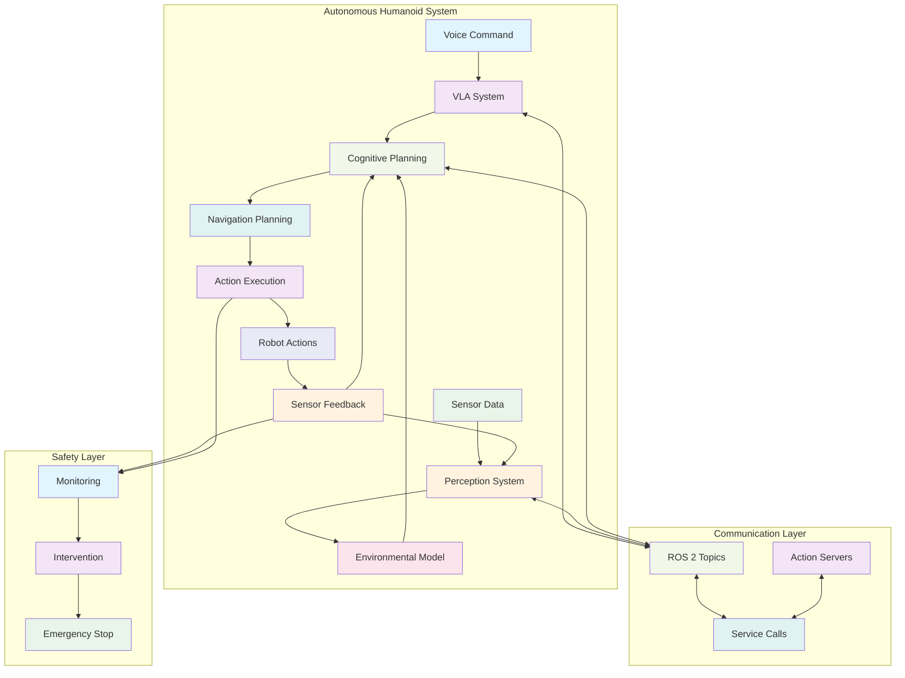

# Chapter 7: Key Concepts

## Core Concepts

### 1. System Integration
**Definition**: The process of combining all individual components into a cohesive, functioning autonomous humanoid system.

**Key Elements**:
- **Component Integration**: Connecting ROS 2, simulation, Isaac, and VLA systems
- **Communication Architecture**: Establishing reliable communication between components
- **Data Flow Coordination**: Managing data flow across all subsystems
- **Timing Synchronization**: Ensuring real-time performance across integrated components

**Significance**: Critical for transforming individual components into a unified autonomous system.

### 2. Autonomous Task Execution Pipeline
**Definition**: The complete sequence from receiving a command to executing a physical action.

**Pipeline Stages**:
- **Input Processing**: Voice command reception and processing
- **Cognitive Planning**: Task decomposition and action planning
- **Navigation Planning**: Path planning and obstacle avoidance
- **Action Execution**: Physical action execution and control
- **Feedback Integration**: Monitoring and adjustment based on results

**Importance**: The pipeline enables natural human-robot interaction through complex task execution.

### 3. Hierarchical System Architecture
**Definition**: Organization of the autonomous humanoid system in multiple levels of abstraction.

**Levels**:
- **Perception Layer**: Environmental sensing and understanding
- **Cognitive Layer**: Planning, reasoning, and decision making
- **Control Layer**: Motion planning and low-level control
- **Execution Layer**: Physical actuation and feedback

**Benefits**: Modularity, specialization, and easier debugging of complex systems.

### 4. Safety-First Design
**Definition**: System design approach that prioritizes safety in all aspects of the autonomous humanoid.

**Principles**:
- **Fail-Safe Operation**: Default to safe state when errors occur
- **Redundancy**: Multiple safety systems for critical functions
- **Monitoring**: Continuous system state monitoring
- **Intervention**: Human override capabilities

**Criticality**: Essential for safe operation around humans in real-world environments.

### 5. Real-time Performance
**Definition**: The ability of the system to process information and respond within strict timing constraints.

**Requirements**:
- **Latency Management**: Meeting timing constraints for responsive interaction
- **Throughput**: Processing sufficient data volume in real-time
- **Predictability**: Consistent performance under varying loads
- **Resource Management**: Efficient use of computational resources

**Applications**: Critical for safe and responsive robot operation.

## Technical Concepts

### 6. ROS 2 Communication Backbone
**Definition**: The ROS 2 infrastructure that connects all system components.

**Components**:
- **Topics**: Continuous data streams between nodes
- **Services**: Request-response communication for specific tasks
- **Actions**: Long-running tasks with feedback and cancellation
- **Parameters**: Dynamic configuration of system components

**Benefits**: Loose coupling, modularity, and standardization of interfaces.

### 7. Multi-Modal Integration
**Definition**: The coordination of information from multiple sensory and control modalities.

**Modalities**:
- **Visual**: Camera and LiDAR data
- **Auditory**: Microphone and speech processing
- **Tactile**: Force and touch sensors
- **Motor**: Joint position and control commands

**Challenges**: Temporal alignment, semantic grounding, and conflict resolution.

### 8. Cognitive Planning Integration
**Definition**: The integration of high-level cognitive planning with low-level execution systems.

**Integration Points**:
- **Task Decomposition**: Breaking complex tasks into executable actions
- **Resource Allocation**: Managing computational and physical resources
- **Temporal Coordination**: Sequencing actions over time
- **Contingency Planning**: Handling unexpected situations

**Benefits**: Enables complex, multi-step task execution with adaptation.

### 9. Perception-Action Loop
**Definition**: The continuous cycle of sensing, processing, planning, and acting.

**Components**:
- **Sensing**: Environmental and robot state data collection
- **Processing**: Data interpretation and understanding
- **Planning**: Action selection and sequencing
- **Acting**: Physical action execution
- **Feedback**: Monitoring and adjustment

**Importance**: Enables adaptive and responsive robot behavior.

## System Architecture Concepts

### 10. Component-Based Architecture
**Definition**: System design approach that organizes functionality into discrete, reusable components.

**Characteristics**:
- **Modularity**: Each component has a single, well-defined function
- **Interchangeability**: Components can be replaced or upgraded independently
- **Standard Interfaces**: Well-defined interfaces between components
- **Testability**: Components can be tested independently

**Benefits**: Maintainability, scalability, and reusability.

### 11. Event-Driven Architecture
**Definition**: System architecture that responds to events or changes in state.

**Elements**:
- **Event Sources**: Components that generate events
- **Event Processors**: Components that respond to events
- **Event Bus**: Communication infrastructure for event delivery
- **Event Handlers**: Functions that process specific events

**Advantages**: Responsiveness, scalability, and loose coupling.

### 12. Microservice Architecture for Robotics
**Definition**: Architecture that decomposes robot functionality into small, independent services.

**Services**:
- **Perception Service**: Handles sensor data processing
- **Planning Service**: Manages task and motion planning
- **Control Service**: Executes low-level control commands
- **Interaction Service**: Manages human-robot interaction

**Benefits**: Scalability, maintainability, and fault isolation.

## Design Patterns for Autonomous Systems

### 13. State Machine Architecture
**Definition**: System design that organizes behavior as a set of states and transitions.

**Components**:
- **States**: Distinct operational modes
- **Transitions**: Conditions for state changes
- **Actions**: Behaviors associated with states or transitions
- **Inputs**: Events that trigger transitions

**Applications**: High-level robot behavior management.

### 14. Blackboard Architecture
**Definition**: System architecture where components contribute to a shared knowledge base.

**Elements**:
- **Blackboard**: Shared data repository
- **Knowledge Sources**: Components that read/write to blackboard
- **Control Component**: Coordinates knowledge source activity
- **Data Abstraction**: Structured representation of information

**Benefits**: Flexible integration of heterogeneous components.

### 15. Behavior-Based Architecture
**Definition**: Architecture that decomposes robot behavior into concurrent, reactive behaviors.

**Characteristics**:
- **Reactivity**: Immediate response to environmental changes
- **Concurrency**: Multiple behaviors active simultaneously
- **Coordination**: Arbitration between competing behaviors
- **Emergence**: Complex behaviors from simple components

**Applications**: Real-time robot control and adaptation.

## Tables: Key Comparisons

### Integration Approaches Comparison

| Approach | Pros | Cons | Best Use |
|----------|------|------|----------|
| Monolithic | Simple, low overhead | Difficult to maintain, fragile | Small, simple systems |
| Component-Based | Modular, testable | Communication overhead | Medium to large systems |
| Microservice | Scalable, fault-tolerant | Complex, network overhead | Large, distributed systems |
| Behavior-Based | Reactive, robust | Complex coordination | Real-time control |

### Safety System Hierarchy

| Level | Function | Response | Criticality |
|-------|----------|----------|-------------|
| Level 1 | Warning | Alert operator | Low |
| Level 2 | Deceleration | Reduce speed | Medium |
| Level 3 | Stop | Emergency stop | High |
| Level 4 | Isolate | Disconnect power | Critical |

### Performance Requirements by System Component

| Component | Frequency Range | Latency | Criticality |
|-----------|-----------------|---------|-------------|
| Control Loop | `100-1000Hz` | `<10ms` | Critical |
| Navigation | `10-50Hz` | `<100ms` | High |
| Perception | `1-10Hz` | `<1s` | Medium |
| Planning | `0.1-1Hz` | `<5s` | Low |

## Mathematical Foundations

### 16. Control Theory Integration
- **State Space Representation**: x_dot = Ax + Bu, y = Cx + Du
- **Feedback Control**: u = K(r - y) for error correction
- **Stability Analysis**: Eigenvalues of (A-BK) for closed-loop stability
- **Optimal Control**: Minimizing cost function J = ∫(x'Qx + u'Ru)dt

### 17. Probabilistic Robotics
- **Bayesian Filtering**: P(x\|z,u) = ηP(z|x)∫P(x|u,x')P(x'|z',u')dx'
- **Kalman Filtering**: Optimal state estimation for linear Gaussian systems
- **Particle Filtering**: Approximate filtering for non-linear, non-Gaussian systems
- **SLAM**: Simultaneous localization and mapping with uncertainty

## Diagrams and Visual Representations



### System Integration Flow

```
Voice Command → VLA Processing → Task Planning → Navigation → Action → Physical Result
      ↑              ↓              ↑            ↓         ↑         ↓
Sensor Input ← Perception ← State Estimation ← Control ← Motor ← Environment
```

## Integration Concepts

### 18. API Standardization
**Definition**: Establishing standard interfaces between system components.

**Standards**:
- **Message Formats**: Standard ROS 2 message types
- **Service Definitions**: Standardized service interfaces
- **Action Definitions**: Standardized action interfaces
- **Parameter Namespaces**: Organized parameter management

**Benefits**: Reusability, compatibility, and ease of integration.

### 19. Middleware Abstraction
**Definition**: Using middleware to abstract communication details.

**Benefits**:
- **Language Independence**: Components in different languages
- **Location Transparency**: Components on different machines
- **Quality of Service**: Guaranteed delivery characteristics
- **Discovery**: Automatic component discovery and connection

## Quality Concepts

### 20. System Validation
**Definition**: Process of verifying that the integrated system meets requirements.

**Methods**:
- **Unit Testing**: Testing individual components
- **Integration Testing**: Testing component interactions
- **System Testing**: Testing complete system behavior
- **Acceptance Testing**: Verifying requirements satisfaction

**Metrics**: Coverage, effectiveness, and efficiency of testing.

### 21. Performance Optimization
**Definition**: Techniques for improving system performance while maintaining functionality.

**Strategies**:
- **Parallel Processing**: Concurrent execution of independent tasks
- **Caching**: Storing computed results for reuse
- **Load Balancing**: Distributing computational load
- **Resource Management**: Efficient allocation of resources

## Safety Concepts

### 22. Functional Safety
**Definition**: Absence of hazardous operational states due to system failures.

**Standards**: IEC 61508, ISO 13482 (service robots), ISO 10218 (industrial robots).

**Elements**:
- **Hazard Analysis**: Identifying potential hazards
- **Risk Assessment**: Evaluating probability and severity
- **Safety Requirements**: Defining safety functions
- **Validation**: Verifying safety requirements

### 23. Safe Human-Robot Interaction
**Definition**: Ensuring safe interaction between humans and robots.

**Approaches**:
- **Physical Safety**: Limiting forces and speeds
- **Operational Safety**: Safe behavior in shared spaces
- **Emergency Procedures**: Response to unsafe conditions
- **Human Factors**: Considering human behavior and limitations

## Performance Concepts

### 24. Real-time Operating Systems
**Definition**: Operating systems that guarantee response within timing constraints.

**Characteristics**:
- **Determinism**: Predictable timing behavior
- **Priority Scheduling**: Ensuring critical tasks execute first
- **Low Latency**: Minimal delay in task execution
- **Memory Protection**: Isolating critical tasks

**Applications**: Time-critical robot control and safety systems.

### 25. Resource Management
**Definition**: Efficient allocation and management of computational resources.

**Resources**:
- **CPU**: Processing power allocation
- **Memory**: RAM and storage management
- **Network**: Communication bandwidth
- **Power**: Energy consumption optimization

**Techniques**: Scheduling, allocation, and optimization algorithms.

## Summary of Key Concepts

These key concepts form the foundation of autonomous humanoid robot development. Understanding these principles is essential for creating integrated systems that combine all the individual components into a cohesive, functioning autonomous robot. The integration of these concepts enables the development of sophisticated humanoid robots capable of complex autonomous behaviors while maintaining safety and reliability.

The success of autonomous humanoid systems depends on careful integration of perception, cognition, and action, with attention to real-time performance, safety, and robustness. The combination of these concepts enables the development of robots capable of natural interaction with humans in real-world environments.