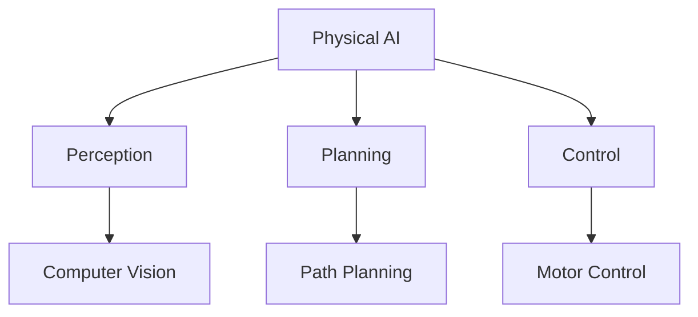

# PHYSICAL AI & HUMANOID ROBOTICS TEXTBOOK - QUICKSTART GUIDE

## 1. PROJECT SETUP

### 1.1 Prerequisites
- **Node.js**: v18.0 or higher
- **npm** or **yarn**: Package manager
- **Git**: Version control system
- **Code Editor**: VS Code recommended with Markdown extensions

### 1.2 Initial Setup
```bash
# Clone the repository
git clone <repository-url>
cd Physical-AI-Humanoid-Robotics

# Install dependencies
npm install
# OR
yarn install

# Start development server
npm start
# OR
yarn start

# The site will be available at http://localhost:3000
```

## 2. DEVELOPMENT FLOW

### 2.1 Creating New Content
1. Follow the 8-chapter structure outlined in the constitution
2. Use the chapter templates found in the docs directory
3. Ensure all content adheres to the AI-Native Textbook Constitution
4. Test all code examples for accuracy and executability

### 2.2 Docusaurus Commands
```bash
# Development
npm start              # Start local development server
npm run build          # Build static files for production
npm run serve          # Serve built files locally
npm run deploy         # Deploy to GitHub Pages (if configured)

# Maintenance
npm run clear          # Clear build cache
npm run swizzle        # Customize Docusaurus components
npm run write-translations  # Extract translation messages
npm run write-heading-ids  # Write heading IDs automatically
```

## 3. CONTENT CREATION

### 3.1 Chapter Template Structure
Each chapter should follow this structure:

```
docs/
├── chapter-01/
│   ├── index.md
│   ├── intro-physical-ai.md
│   ├── learning-outcomes.md
│   ├── key-concepts.md
│   └── exercises.md
```

### 3.2 Writing Guidelines
- Use Markdown for all content
- Follow the learning objectives format using Bloom's taxonomy
- Include executable code examples with proper language identifiers
- Add diagrams using Mermaid or embedded images
- Include cross-references to related chapters

### 3.3 Code Example Format
```python
# Good: Properly formatted with language identifier
import rospy
from std_msgs.msg import String

def talker():
    """ROS 2 publisher example"""
    pub = rospy.Publisher('chatter', String, queue_size=10)
    rospy.init_node('talker', anonymous=True)
    rate = rospy.Rate(10)  # 10hz
    while not rospy.is_shutdown():
        hello_str = "Hello World %s" % rospy.get_time()
        rospy.loginfo(hello_str)
        pub.publish(hello_str)
        rate.sleep()
```

## 4. CONSTITUTION COMPLIANCE

### 4.1 Required Elements
Every chapter must include:
- [ ] Learning objectives using Bloom's taxonomy verbs (understand, apply, analyze, evaluate, create)
- [ ] 3-5 executable code examples with proper syntax highlighting
- [ ] 1-2 diagrams or visual aids with alt text
- [ ] Summary section with key takeaways
- [ ] 3-5 exercises for reinforcement
- [ ] Cross-references to related chapters
- [ ] All content under 200KB file size limit

### 4.2 Quality Checks
- [ ] All code examples are syntactically correct
- [ ] Learning objectives align with Bloom's taxonomy
- [ ] Diagrams have proper alt text for accessibility
- [ ] Cross-references point to correct locations
- [ ] Content follows the 8-chapter sequence

## 5. DIAGRAMS AND VISUALS

### 5.1 Mermaid Diagrams
Use Mermaid for creating diagrams directly in Markdown:



### 5.2 Image Standards
- Optimize images for web delivery (WebP, SVG, or compressed formats)
- Include descriptive alt text following accessibility standards
- Keep images under 500KB to maintain page load speeds
- Use consistent styling and color schemes

## 6. DEPLOYMENT

### 6.1 Build and Deploy
```bash
# Build the site
npm run build

# Test locally
npm run serve

# Deploy (if configured)
npm run deploy
```

### 6.2 Vercel Deployment
This project is configured for deployment on Vercel:
1. Connect your Git repository to Vercel
2. Set build command to `npm run build`
3. Set output directory to `build`
4. Environment variables will be automatically detected

## 7. TROUBLESHOOTING

### 7.1 Common Issues

**Issue**: Docusaurus won't start
**Solution**: Clear cache and reinstall dependencies
```bash
npm run clear
rm -rf node_modules package-lock.json
npm install
npm start
```

**Issue**: Build fails with warnings
**Solution**: Check for syntax errors in Markdown files and missing frontmatter

**Issue**: Images not loading
**Solution**: Verify image paths relative to the static directory

### 7.2 Getting Help
- Check the documentation in the `docs` folder
- Review the constitution in `.specify/memory/constitution.md`
- Look at existing chapters for pattern examples
- Examine the specs in the `specs` folder for detailed requirements

## 8. NEXT STEPS

1. **Chapter Development**: Start creating content following the 8-chapter structure
2. **Code Examples**: Implement executable examples that reinforce concepts
3. **Diagrams**: Add visual elements to enhance understanding
4. **Testing**: Verify all examples work as expected
5. **Review**: Ensure compliance with the AI-Native Textbook Constitution

Remember to always refer to the constitution for architectural decisions and content standards!